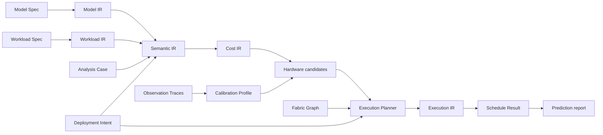

# GroundUpScale

**Explainable, composable performance modeling from hardware atoms to model
throughput.**

GroundUpScale is an early-stage system for deriving AI workload performance and
resource estimates from first principles, then calibrating those estimates with
versioned measurements. It is designed to keep model hierarchy, workload
control, formulas, hardware choices, scheduling, and evidence independently
inspectable instead of hiding them in one black-box graph.

## Intended scope

- training: initialization, forward, backward, loss, optimizer, and checkpoint;
- inference: initialization, prefill, decode, postprocessing, and state save;
- reinforcement learning: inference, training, data movement, weight conversion,
  and version publication;
- nested model structures such as vision plus language models and heterogeneous
  attention or MoE layers;
- execution strategies such as FSDP, offload, TP, PP, EP, CP, MoonEP,
  chunked prefill, and disaggregated services;
- heterogeneous accelerators, CPUs, memory domains, storage, and interconnects;
- predicted latency, throughput, utilization, memory, communication, bubbles,
  bounds, and measured error.

## Compilation model



Human-authored inputs use one strict, versioned YAML Spec format. Intermediate
representations are immutable, provenance-linked products of explicit compiler
stages. Plugins can add model semantics, strategies, hardware implementations,
and schedulers without mutating compiler state or relying on implicit order.

## Current status

The first vertical slice now compiles strict YAML for a fixed-shape, causal,
two-layer Transformer through Model IR, Workload IR, Semantic IR, and
hardware-independent Cost IR; runs the same reference on CPU/MPS; and emits
digest-verified benchmark, trace, alignment, live-set, explanation, and HTML
artifacts in an immutable Run Bundle.

The Apple M4 CPU path now also lowers Cost IR into 52 inspectable hardware
implementation candidates. It preserves Apple's public 4P+6E topology, Neon
instruction semantics, and 120 GB/s SoC-shared unified-memory peak while
keeping the unpublished vendor CPU FLOP/s explicitly unknown. A separate
multi-Shape HardwareCapabilityProfile supplies measured P80/P95 compute and
memory resource envelopes without overwriting those vendor facts. The backend
uses minimum mathematical work and unique compulsory Scope bytes to emit
`max(compute, memory)` algorithm-independent hardware floors; full implementation
duration remains null. The bounds, assumptions, raw-evidence digest, capability
quality, and per-operation candidates are available in compile output, Run
Bundles, CLI, Explanation Graph, and HTML instead of being presented as a
calibrated latency.
Each CPU Run also emits a Stable-Path-aligned prediction-versus-observation
comparison: empirical hardware floors are shown beside measured medians without
mislabeling their distance as prediction error, while matching framework Tensor
peak-memory values receive a real absolute and relative error calculation.

The controlled calibration workflow is implemented and refuses mixed cohorts,
fit/holdout overlap, noisy fitting data, insufficient valid holdouts, or a
failed 5% gate. Trusted Mac runs now also fail closed on a versioned preflight
for platform, AC power, thermal status, settled load, and competing processes;
calibration rejects any Bundle without a passed preflight. The current local
experiment intentionally remains unpromoted: repeated uncontrolled
measurements did not yield the required five holdouts whose `IQR / median` all
stayed below 3%. See the
[M4 report](goal_process/mac-transformer-ir-calibration-slice/evidence/m4-milestone-report.md)
and the [local runbook](docs/runbooks/local-mac-calibration.md).

## Quick start

```sh
uv sync --locked --group dev
uv run pytest -q
uv run groundupscale preflight --json  # trusted hardware evidence only
uv run groundupscale run specs/plans/mac-cpu-prefill.yaml \
  --repository-root . --run-id example-cpu \
  --target-window-ms 100 --windows-per-sample 9 --json
uv run groundupscale explain .groundupscale/runs/example-cpu
```

For calibration-grade local evidence, use
`scripts/run-local-m4-evidence.sh <tag>` or add
`--require-valid-environment`; an ordinary development run is deliberately
marked `environment_validity=not-required` and cannot enter calibration.

## Design documents

- [Domain language](CONTEXT.md)
- [Semantic compilation](docs/architecture/semantic-compilation.md)
- [Cost formulas and worked example](docs/methods/cost-model-formulas.md)
- [Apple M4 CPU public-capability backend](docs/methods/apple-m4-cpu-backend.md)
- [Prediction-versus-observation comparison](docs/methods/prediction-observation-comparison.md)
- [Apple M4 CPU primary-source capability research](docs/research/apple-m4-cpu-capabilities.md)
- [Explainability architecture](docs/architecture/explainability.md)
- [Hardware measurement and calibration CI](docs/validation/hardware-calibration-ci.md)
- [Instrumentation and trace alignment](docs/validation/instrumentation-and-trace-alignment.md)
- [Workspace and Run Bundle layout](docs/reference/workspace-and-run-bundle.md)
- [Local Mac execution and calibration runbook](docs/runbooks/local-mac-calibration.md)
- [Architecture decision records](docs/adr/)
