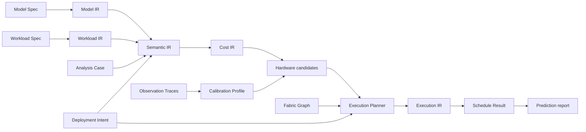

# GroundUpScale

**Explainable, composable performance modeling from hardware atoms to model
throughput.**

GroundUpScale is an early-stage system for deriving AI workload performance and
resource estimates from first principles, then calibrating those estimates with
versioned measurements. It is designed to keep model hierarchy, workload
control, formulas, hardware choices, scheduling, and evidence independently
inspectable instead of hiding them in one black-box graph.

## Intended scope

- training: initialization, forward, backward, loss, optimizer, and checkpoint;
- inference: initialization, prefill, decode, postprocessing, and state save;
- reinforcement learning: inference, training, data movement, weight conversion,
  and version publication;
- nested model structures such as vision plus language models and heterogeneous
  attention or MoE layers;
- execution strategies such as FSDP, offload, TP, PP, EP, CP, MoonEP,
  chunked prefill, and disaggregated services;
- heterogeneous accelerators, CPUs, memory domains, storage, and interconnects;
- predicted latency, throughput, utilization, memory, communication, bubbles,
  bounds, and measured error.

## Compilation model

Human-authored inputs use one strict, versioned YAML Spec format. Intermediate
representations are immutable, provenance-linked products of explicit compiler
stages. Plugins can add model semantics, strategies, hardware implementations,
and schedulers without mutating compiler state or relying on implicit order.

## Current status

The repository is in architecture definition. The first planned vertical slice
is a fixed-shape, two-layer Transformer-like model built from MatMul, Add, and
RMSNorm, compiled through Semantic IR and Cost IR, predicted on CPU and Apple
MPS, and compared with immutable local measurements.

## Design documents

- [Domain language](CONTEXT.md)
- [Semantic compilation](docs/architecture/semantic-compilation.md)
- [Explainability architecture](docs/architecture/explainability.md)
- [Hardware measurement and calibration CI](docs/validation/hardware-calibration-ci.md)
- [Instrumentation and trace alignment](docs/validation/instrumentation-and-trace-alignment.md)
- [Workspace and Run Bundle layout](docs/reference/workspace-and-run-bundle.md)
- [Architecture decision records](docs/adr/)
