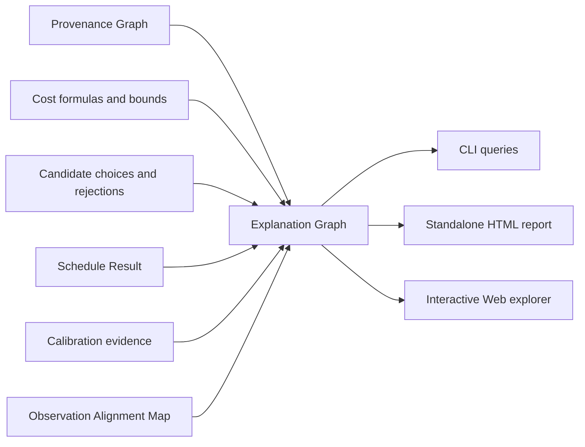

# Explainability architecture

> **In one sentence:** Every GroundUpScale result is drillable from a headline
> metric through scopes, formulas, physical causes, uncertainty, and evidence
> using one queryable Explanation Graph shared by CLI, HTML, and Web views.

## Explainability is a data contract

A visualization cannot recover reasoning that was discarded during compilation.
GroundUpScale therefore constructs explanations from retained identities and
derivations before choosing how to display them.



Explanation Graph is a derived result, not another compilation IR. It references
entities already owned by Model IR, Workload IR, Semantic IR, Cost IR, Execution
IR, Schedule Result, Provenance Graph, and observation artifacts.

## Metric Derivation

Every user-facing metric has a Metric Derivation containing:

```text
metric identity, name, value, unit, and scope
derivation expression and aggregation semantics
contributing values, events, scopes, and resources
assumptions, lower and upper bounds, and uncertainty
base prediction and Calibration Profile delta
critical-path, concurrency, or live-set context
source Derivation Records and Observation spans
validity domain and warnings
```

The aggregation kind is mandatory. Examples include:

- `sum`: serialized work whose durations may be added;
- `max`: parallel branches where elapsed time is the maximum branch completion;
- `critical_path`: dependency-constrained schedule contribution;
- `peak_live_set`: simultaneous live allocations at a point in time;
- `inclusive` and `exclusive`: hierarchical ownership views;
- `shared`: a contribution that must not be counted independently per consumer;
- `ratio`: throughput or utilization with explicit numerator and denominator.

This prevents a Web view from adding parallel branch durations or charging one
aliased allocation to every model layer.

## Drill-down path

```text
headline throughput, latency, utilization, or peak memory
    -> workload stage
        -> model and module Stable Path
            -> Semantic operation or logical state
                -> Cost Formula and Resource Demand
                    -> selected Implementation Candidate
                        -> physical events and schedule cause
                            -> aligned Observation spans and evidence
```

Each transition is backed by existing Node IDs and Derivation Records. A missing
link is surfaced as an explanation-coverage defect rather than guessed by the UI.

## Latency and throughput explanation

Elapsed time is not generally the sum of all module durations. The explanation
must distinguish:

- serialized work on the critical path;
- overlapped compute, communication, and transfer;
- dependency, queue, capacity, contention, and synchronization waits;
- warmup, steady-state, and drain intervals;
- work outside the configured Observation Window;
- time that could not be attributed to compiled events.

For throughput, the derivation exposes completed work, the exact observation
duration, batching and driver assumptions, and whether the result is a warmup,
steady-state, or finite-horizon value.

## Memory explanation

Peak memory is explained as a snapshot of live physical allocations rather than
a sum of tensor sizes by module:

```text
peak timestamp and memory domain
    -> live Memory Allocations
        -> Artifact Replicas, workspaces, and allocator reserve
            -> logical State Artifacts and Semantic scopes
                -> create/materialize/read/write/evict/free causes
```

The interface exposes complementary views:

- exclusive ownership;
- inclusive subtree residency;
- shared and aliased allocations;
- marginal contribution to the selected peak;
- retained memory and the dependency preventing earlier release.

Logical sizes, requested physical bytes, aligned bytes, allocator-reserved bytes,
and platform-reported memory remain separate quantities.

## Prediction-versus-observation explanation

An Error Attribution classifies evidence into:

| Cause | Question |
|---|---|
| Semantic | Was work, dataflow, or state behavior missing or extra? |
| Cost | Were operation counts, bytes, communication, or lifetimes wrong? |
| Backend | Was the selected implementation or Duration Model inaccurate? |
| Schedule | Were overlap, contention, queueing, or synchronization inaccurate? |
| Observation | Was alignment incomplete or instrumentation intrusive? |
| Environment | Did hardware, software, power, thermal, or workload conditions drift? |

Residuals are not spread uniformly over modules. Unexplained differences remain
in an explicit unattributed bucket with the evidence and confidence that limit a
stronger conclusion.

## Explanation interface

The external seam should remain small:

```python
result = explainer.explain(run, metric, scope=None, depth=None)
diff = explainer.compare(prediction_run, observation_run, scope=None)
```

The result is structured data suitable for terminal summaries, standalone HTML,
or an interactive Web client. Presentation adapters never reimplement metric
math or attribution rules.

## Web views

The initial Web explorer should project the same explanation data into:

1. a nested Workload and model tree with latency, memory, utilization, or error
   heat-map overlays;
2. predicted and observed timelines with critical-path and bubble lanes;
3. peak-memory live-set and object-lifetime views;
4. logical and physical communication views;
5. a formula, assumptions, uncertainty, calibration, and provenance drawer;
6. side-by-side strategy and configuration comparison.

The first implementation may generate a self-contained HTML report. A hosted Web
application can later consume the same Run Manifest and Explanation Graph.

## Explanation quality gates

A report is valid only when:

- every headline metric has a Metric Derivation;
- every derivation declares its aggregation semantics;
- every source value has a unit and provenance;
- shared memory and concurrent time cannot be double-counted silently;
- calibration preserves the base prediction and evidence identity;
- incomplete alignment and unexplained residuals remain visible;
- all drill-down links resolve or carry an explicit missing-coverage diagnostic.
