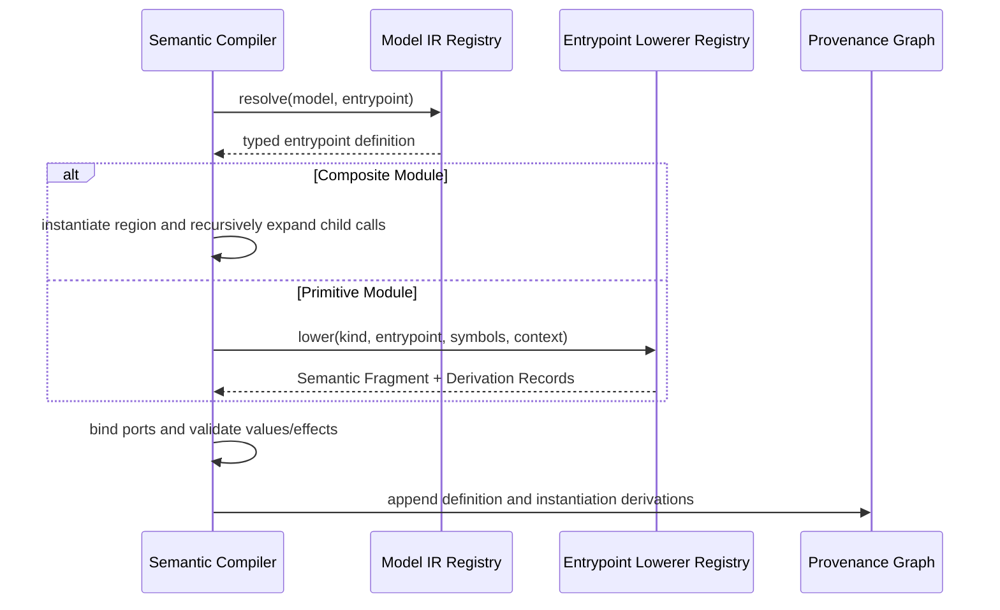

# Semantic compilation

> **In one sentence:** Semantic Compiler combines hierarchical workload control,
> recursively expanded model entrypoints, analysis conditions, and logical
> strategy effects into one deterministic, hardware-independent Semantic IR.

## Why this layer exists

Model IR answers what a model contains. Workload IR answers which logical stages
run and how Artifacts move between them. Neither representation alone says what
mathematical and logical work a selected analysis performs.

Semantic IR is that missing meaning layer. It must be detailed enough for Cost
Lowerer to derive compute, memory, communication, storage, and host-work demand,
but it must not select a physical device, implementation, collective algorithm,
route, duration, or schedule.

## Representation

Semantic IR is a hierarchical region program rather than one flat DAG.

```text
SemanticProgram
├── symbols and constraints
├── logical State Artifacts
└── root Semantic Region
    ├── workload control operations
    │   ├── Sequence / Parallel / Branch / Loop / Map
    │   ├── Pipeline
    │   └── Service
    ├── model and entrypoint scope operations
    │   └── nested Semantic Regions
    └── semantic leaf operations
        ├── mathematical operations
        ├── logical communication
        ├── Artifact operations
        └── explicit State Effects
```

A Semantic Region owns an ordered or structured set of operations and may own
nested regions. Typed Values carry tensor, scalar, token, and Artifact dataflow.
Loops and long-running behavior remain structured operations with carried values
or state; they are not represented as unexplained graph cycles.

Every entity carries:

- a Definition ID when it comes from a reusable definition;
- a Stable Path identifying its logical model or workload location;
- a Node ID identifying the concrete entity in this compilation;
- references to immutable Derivation Records.

## Semantic Compiler interface

The compiler is a deep module with one primary interface:

```python
result = semantic_compiler.compile(request)
```

Conceptually, the request and result are:

```text
SemanticCompileRequest
├── Workload IR
├── referenced Model IRs
├── Analysis Case
├── Resolved Deployment Plan
└── Compilation Context

CompilationResult[Semantic IR]
├── Semantic IR
├── Provenance Graph
├── diagnostics
├── validation results
└── Compilation Fingerprint
```

Callers do not orchestrate individual passes. The compiler owns phase ordering,
fragment caching, proposal application, invariant checking, canonicalization,
and provenance construction behind this interface.

## Compilation flow

```mermaid
flowchart LR
    A["Resolve references and bind symbols"] --> B["Build the Workload region skeleton"]
    B --> C["Recursively expand ModelCall entrypoints"]
    C --> D["Link Typed Values, Artifacts, and State Effects"]
    D --> E["Apply semantic strategy proposals"]
    E --> F["Normalize operations and constraints"]
    F --> G["Verify, canonicalize, and fingerprint"]
    G --> H["Semantic IR"]
```



### Phase 1: resolve and bind

Resolve every Spec Reference and ModelCall target, validate pinned Schemas and
plugins, resolve Deployment Intent bindings, and bind Analysis Case values into
a symbolic environment. Values that are intentionally unknown remain typed
symbols with explicit constraints.

### Phase 2: build the workload skeleton

Translate Workload IR hierarchy into Semantic Regions while retaining Sequence,
Parallel, Branch, Loop, Map, Pipeline, and Service semantics. Non-model Action
Nodes become semantic actions or placeholders with typed ports.

### Phase 3: expand model entrypoints

Module hierarchy alone cannot determine execution order or residual dataflow.
Each Model IR module therefore exposes named entrypoints with typed ports and a
structured body.

- A Composite Module entrypoint is expanded recursively from its declared child
  calls, control, connections, and state use.
- A Primitive Module entrypoint is handled by a registered Entrypoint Lowerer,
  which returns a reusable Semantic Fragment.
- Each fragment is instantiated under the ModelCall's identity namespace and
  connected through Typed Values.



### Phase 4: link Artifacts and state

Connect cross-stage Artifact flow, make logical state versions explicit, and
materialize every read, write, create, alias, migration, eviction, or release as
a State Effect. Physical replicas, buffers, memory addresses, and allocator
behavior are introduced only in later IRs.

### Phase 5: apply strategy semantics

Strategies such as FSDP, tensor/expert/context parallelism, activation
checkpointing, offload, or chunked prefill may alter logical partitioning,
communication, recomputation, and state lifetimes. Their plugins submit
immutable Transform Proposals at named phases. The compiler applies proposals
transactionally and appends their Derivation Records.

Plugins may declare `requires`, `before`, and `after` relationships within a
named phase. The compiler topologically orders them and rejects dependency
cycles, unmet preconditions, and incompatible overlapping changes. Numeric
priority and file-order precedence are not semantic contracts.

### Phase 6: normalize and verify

Canonicalize equivalent operations and expressions, solve the supported subset
of symbolic constraints, verify invariants, and compute a deterministic
Compilation Fingerprint from every effective input and extension version.

## Required invariants

A Semantic IR is valid only when:

1. every operation and region has identity and provenance;
2. every operand resolves to one compatible Typed Value;
3. every produced value declares type, shape, logical layout, and consumers;
4. every state interaction is an explicit State Effect;
5. every symbol is bound or constrained;
6. structured control owns valid nested regions and carried values;
7. Artifact flow and entrypoint ports are type-compatible;
8. no physical device, latency, measured utilization, route, or schedule appears;
9. canonical serialization and fingerprinting are deterministic.

## Plugin seams

Only behavior that genuinely varies receives a seam.

```text
Entrypoint Lowerer seam
    Primitive Module call -> Semantic Fragment

Semantic strategy seam
    Immutable IR snapshot + resolved binding -> Transform Proposal
```

The core compiler owns composite expansion and proposal application. Plugins do
not receive mutable compiler internals and cannot silently edit an existing IR.

## Verification strategy

Compiler tests operate through the Semantic Compiler interface:

- golden tests compare canonical Semantic IR for representative YAML inputs;
- invariant tests reject broken types, state effects, references, and provenance;
- equivalence tests compare Model Repeat against an explicit expansion;
- metamorphic tests check expected scaling when batch or sequence symbols change;
- strategy tests assert conservation of logical values and state across rewrites;
- determinism tests compile the same pinned request repeatedly and compare hashes.

These tests require no accelerator and run on every pull request.

## Explicit non-goals

Semantic Compiler does not:

- derive FLOP or byte-count formulas; Cost Lowerer does that;
- choose kernels or fusion implementations; Hardware Backend proposes those;
- place work or route communication; Execution Planner does that;
- predict start and end times; Scheduler Plugin does that;
- incorporate observations directly; Calibration Profiles affect Duration Models.
