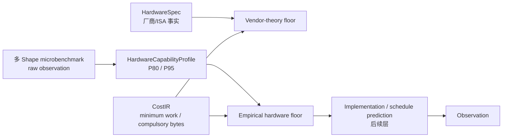

# Apple M4 CPU 资源包络后端

> 一句话：M4 CPU 后端同时保留 Apple 官方物理事实和本机多 Shape 实测能力，使用最小数学工作量与 compulsory bytes 计算算法无关硬件地板，不把当前 kernel 或调度效率伪装成硬件能力。

## 四层结果



四层互不覆盖：

1. `HardwareSpec` 保留 Apple 官方的 4P+6E、Neon 128 bit 和 SoC 共享 `120 GB/s`；CPU FP32 理论 FLOP/s 仍为 `unknown`。
2. `HardwareCapabilityProfile` 引用原始观测 SHA-256，保存跨 Shape 的 P80/P95 经验能力。
3. HardwareBackend 用前两层生成算法无关硬件地板；`full_duration_ns` 仍为 `null`。
4. Benchmark Observation 保存当前 PyTorch/Accelerate 实现的真实耗时，二者差距是优化空间，不是点预测误差。

## Microbenchmark Suite

入口是唯一的人类编写格式 YAML：

```text
specs/microbenchmarks/apple-m4-cpu.yaml
├── scalar-fp32-fma-chain   # 原生 ARM64 scalar FMADD
├── vector-fp32-fma         # elementwise vector
├── matrix-fp32-cube        # matrix/cube
├── shared-memory-copy      # 1 read + 1 write
└── shared-memory-triad     # 3 reads + 1 write
```

每个探针至少包含 10 个不同 Shape，当前配置使用 12 个，并覆盖
`127/128/129`、`255/256/257`、`511/512/513` 等对齐与非对齐边界。
同一个 Shape 可测多个线程数；聚合时先选择该 Shape 的最高稳定速率，再计算：

```text
probe robust rate     = P80(best rate per Shape)
probe optimistic rate = P95(best rate per Shape)
resource robust rate  = max(probe P80 mapped to the resource)
resource optimistic   = max(probe P95 mapped to the resource)
```

P80 是稳健可达参考，不是数学峰值；P95 是更乐观的经验边界。原始样本、median、
IQR、线程数、Shape、实现、软件版本、环境门禁和 Cohort 全部保留。

运行命令：

```sh
uv run groundupscale benchmark-hardware \
  specs/microbenchmarks/apple-m4-cpu.yaml \
  --repository-root . \
  --observation-output goal_process/mac-transformer-ir-calibration-slice/evidence/apple-m4-cpu-microbenchmark-observation-v2.json \
  --profile-output specs/hardware-capabilities/apple-m4-cpu-local.yaml \
  --profile-name apple-m4-cpu-local --json
```

`--require-valid-environment` 用于可信基线；不加该参数时允许功能穿刺，但 Profile
会保留 `environment.eligible=false` 和原因，不能冒充 trusted CI evidence。

## 算法无关地板

CostIR 和后端区分：

- `minimum mathematical FLOPs`：语义所要求的最小数学工作；
- `compulsory bytes`：一个 Scope 的唯一外部输入、状态和外部可见输出；
- `materialized bytes`：当前分解产生的全部中间读写，仅用于实现层分析。

对任意 Scope：

```text
T_compute = minimum_work_flops / compute.fp32.P80
T_memory  = compulsory_bytes / memory.shared.P80
T_floor   = max(T_compute, T_memory)
```

只有计算与访存允许完全重叠时才可直接取 `max`。后续存在共享资源、互斥或依赖时，
必须通过 Resource Claim 和关键路径组合，不能继续套用单一 roofline。

## 本机 M4 实测配置

当前 `apple-m4-cpu-local` Profile：

| 资源 | P80 | P95 | 胜出探针 |
|---|---:|---:|---|
| `compute.fp32` | 1.74845 TFLOP/s | 1.87490 TFLOP/s | matrix cube |
| `memory.shared` | 126.833 GB/s | 133.844 GB/s | memory copy |

copy P80 比 Apple 官方 `120 GB/s` 高 `5.69%`，处于预设 10% 语义核验预算内；
P95 高 `11.54%`，所以不会替代 P80 成为稳健地板。Apple 没有发布语义可比的
CPU FP32 FLOP/s，计算能力仍只标记为 measured，而不是 vendor theoretical。

## 计算范例

两层 Transformer：

```text
minimum_work_flops = 9,710,850,048
compulsory_bytes   = 37,756,928

T_compute = 9,710,850,048 / 1,748,450,139,577.8 = 5.553976 ms
T_memory  = 37,756,928 / 126,832,587,409.13748  = 0.297691 ms
T_floor   = max(5.553976, 0.297691)               = 5.553976 ms
```

第一层 Q projection：

```text
minimum_work_flops = 268,435,456
compulsory_bytes   = 3,145,728
T_compute          = 0.153528 ms
T_memory           = 0.024802 ms
T_floor            = 0.153528 ms
```

本轮 Q projection 实测 `0.154288 ms`，为地板的 `1.005×`；两层 E2E 实测
`92.814479 ms`，为地板的 `16.711×`。前者说明 matrix 实现接近本轮能力包络；
后者暴露非矩阵操作、融合、框架和调度层的巨大优化空间。

## 配置和产物

```text
specs/hardware/apple-m4.yaml
  厂商与 ISA 事实，不写本机实测值

specs/microbenchmarks/apple-m4-cpu.yaml
  人类编写的探针、Shape、线程与统计协议

goal_process/.../evidence/apple-m4-cpu-microbenchmark-observation-v2.json
  不可变原始样本

specs/hardware-capabilities/apple-m4-cpu-local.yaml
  资源键化的 P80/P95 包络和 raw SHA-256

specs/plans/mac-cpu-prefill.yaml
  显式引用 HardwareSpec 与 HardwareCapabilityProfile
```

AnalysisPlan 加载时会重新计算原始观测 SHA-256；文件缺失或摘要不一致会拒绝
编译。后端只消费 target hardware/device 匹配的唯一 Profile，多个匹配 Profile
也会拒绝，避免静默选择。
