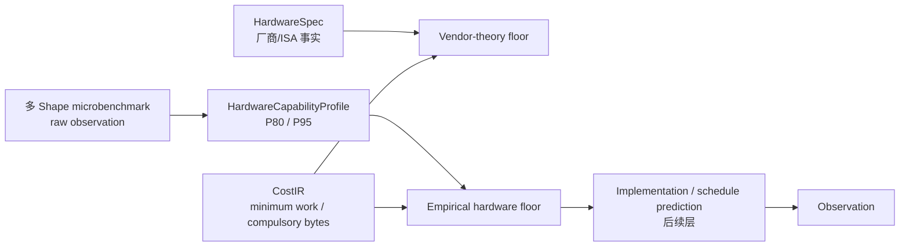

# Apple M4 CPU 资源包络后端

> 一句话：M4 CPU 后端同时保留 Apple 官方物理事实和本机多 Shape 实测能力，使用最小数学工作量与 compulsory bytes 计算算法无关硬件地板，不把当前 kernel 或调度效率伪装成硬件能力。

## 四层结果



四层互不覆盖：

1. `HardwareSpec` 保留 Apple 官方的 4P+6E、Neon 128 bit 和 SoC 共享 `120 GB/s`；CPU FP32 理论 FLOP/s 仍为 `unknown`。
2. `HardwareCapabilityProfile` 引用原始观测 SHA-256，保存跨 Shape 的 P80/P95 经验能力。
3. HardwareBackend 用前两层生成算法无关硬件地板；`full_duration_ns` 仍为 `null`。
4. `OperatorFrontierProfile` 可为完全一致的 Shape、dtype、layout、threads、
   execution mode、candidate family 与 Hardware Validity Cohort 提供
   `QUALIFIED + ACTIVE` exact Anchor；它不覆盖 Resource Physical Floor。
5. Benchmark Observation 保存当前 PyTorch/Accelerate 实现的真实耗时；
   Observation/Physical Floor 是优化空间，而
   `Frontier latency / Observation latency` 是 Frontier Efficiency，均不是点预测误差。

## Microbenchmark Suite

入口是唯一的人类编写格式 YAML：

```text
specs/microbenchmarks/apple-m4-cpu.yaml
├── scalar-fp32-fma-chain   # 原生 ARM64 scalar FMADD
├── vector-fp32-fma         # elementwise vector
├── matrix-fp32-cube        # matrix/cube
├── shared-memory-copy      # 1 read + 1 write
├── shared-memory-triad     # 3 reads + 1 write
├── phase-reduction-*       # row max / sum
├── phase-row-*             # broadcast subtract / divide
├── phase-elementwise-*     # exp / square / multiply
├── phase-scalar-*          # divide / add / rsqrt
└── phase-*-memory          # reduction / broadcast / elementwise / row scalar
```

每个探针至少需有 10 个不同 Shape 通过稳定性门禁，当前配置每类提供
12–15 个 Shape，并覆盖
`127/128/129`、`255/256/257`、`511/512/513` 等对齐与非对齐边界。
同一个 Shape 可测多个线程数；聚合时先选择该 Shape 的最高稳定速率，再计算：

```text
probe robust rate     = P80(best rate per Shape)
probe optimistic rate = P95(best rate per Shape)
resource robust rate  = max(probe P80 mapped to the resource)
resource optimistic   = max(probe P95 mapped to the resource)
```

P80 是稳健可达参考，不是数学峰值；P95 是更乐观的经验边界。原始样本、median、
IQR、线程数、Shape、实现、软件版本、环境门禁和 Cohort 全部保留。

复合算子不得复用 `compute.fp32` 矩阵乘或 `memory.shared` 批量拷贝
冒充 phase 能力。Softmax/RMSNorm 只在上述 reduction、transcendental、
broadcast 和其他精确 resource 都有唯一、单位匹配的实测包络时产生
phase schedule 数值；任一类缺失都返回 structured `unknown`。

运行命令：

```sh
uv run groundupscale benchmark-hardware \
  specs/microbenchmarks/apple-m4-cpu.yaml \
  --repository-root . \
  --observation-output goal_process/mac-transformer-ir-calibration-slice/evidence/apple-m4-cpu-phase-microbenchmark-observation-v3.json \
  --profile-output specs/hardware-capabilities/apple-m4-cpu-phase-local.yaml \
  --profile-name apple-m4-cpu-phase-local --profile-version 0.2.0 \
  --require-valid-environment --json
```

`--require-valid-environment` 用于可信基线。不加该参数时只允许功能穿刺：
Profile 会保留 `environment.eligible=false` 和原因，不得被 Analysis Plan
促进成受信 prediction evidence。
新 Profile 成功生成后，再原子更新 Analysis Plan 的 path/version；旧
`apple-m4-cpu-local.yaml@0.1.0` 在此前保持可回放，不被半成功采集覆盖。

## 算法无关地板

CostIR 和后端区分：

- `minimum mathematical FLOPs`：语义所要求的最小数学工作；
- `candidate compulsory bytes`：当前未融合候选必须物化的读写；alias-only
  View/Transpose 为 0；
- `fused boundary bytes`：只有后端提供显式融合候选时，才按该候选的外部边界计数。

对单个候选：

```text
T_compute_i = minimum_work_flops_i / compute.fp32.P80
T_memory_i  = materialized_bytes_i / memory.shared.P80
T_local_i   = max(T_compute_i, T_memory_i)
```

`max` 只表达该候选内部允许的计算—访存重叠。当前 eager CPU 参考是
`serialized-unfused`，所以 Scope 地板为 `sum_i(T_local_i)`。同时保留乐观参考：

```text
T_ideal_DAG = max(longest_dependency_path(T_local_i),
                  max_resource(sum_i(T_resource_i)))
```

未来存在融合、通信掩盖或流水重叠时，必须由显式 Implementation Candidate、
Resource Claim 和调度依赖表达，不能从父模块边界推断。

复合算子 phase 使用更严格的精确资源：operation-class probe 计时一次
完整 phase invocation，已包含必要数据移动；memory-pattern probe 是同一
invocation 的独立下界。因此 phase 内是
`max(T_exact_operation, T_memory_pattern)`，并保留两条 Profile 证据引用；
不得相加重复计时。phase 之间仍按依赖串行相加。

## 本机 M4 实测配置

当前 `apple-m4-cpu-local` Profile：

| 资源 | P80 | P95 | 胜出探针 |
|---|---:|---:|---|
| `compute.fp32` | 1.74845 TFLOP/s | 1.87490 TFLOP/s | matrix cube |
| `memory.shared` | 126.833 GB/s | 133.844 GB/s | memory copy |

copy P80 比 Apple 官方 `120 GB/s` 高 `5.69%`，处于预设 10% 语义核验预算内；
P95 高 `11.54%`，所以不会替代 P80 成为稳健地板。Apple 没有发布语义可比的
CPU FP32 FLOP/s，计算能力仍只标记为 measured，而不是 vendor theoretical。

## 计算范例

两层 Transformer：

```text
sum minimum_work_flops       = 9,710,850,048
sum materialized bytes       = 289,415,168
sum candidate compute terms  = 5.553976 ms
sum candidate memory terms   = 2.281868 ms
dependency critical path     = 4.990978 ms
shared-resource bound        = 5.553976 ms
ideal DAG reference          = 5.553976 ms
generic Resource Physical Floor = sum_i(max(compute_i, memory_i))
                                = 6.833310 ms
selected compound reference     = unknown
```

第一层 Q projection：

```text
minimum_work_flops = 268,435,456
compulsory_bytes   = 3,145,728
T_compute          = 0.153528 ms
T_memory           = 0.024802 ms
T_floor            = 0.153528 ms
```

Q projection 仍是单一原子候选，因此局部、串行和理想 DAG 三种资源地板
相同，但仍不是当前实现的点预测。含 RMSNorm/Softmax 的模块与 E2E
在精确 phase capability 缺失时必须展示 `selected=unknown`，通用 Resource
Physical Floor 和 ideal DAG 只作非采纳参考，不可混为预测值。

## 512³ MatMul exact-Shape Frontier

`groundupscale qualify-frontier` 从 3 个独立 search Run Bundle 和 3 个独立
holdout Run Bundle 构建 exact Anchor。每个 Bundle 必须 digest-valid、strict
environment-eligible，并携带同一完整 Hardware Validity Cohort、可复算的 PyTorch
runtime binary candidate digest、固定 input corpus、精确 stride/alignment/working-set
execution contract，以及独立 FP64 MatMul oracle。计时还必须满足 500 次 warmup、
稳态漂移不超过 5%、至少 20×5 个窗口、至少 100 ms 累计计时和 session
IQR/median 不超过 3%。Point estimate 是 holdout session medians 的中位数；
标准不确定度是这些 holdout medians 的样本标准差。Profile 同时嵌入每个会话的
原始 `samples_ns`，schema 会重算 session median/IQR，不信任作者汇总字段。

当前第一层 Q projection（`[1,512,512] @ [512,512]`、FP32 contiguous、
4 threads、eager、`torch.matmul.cpu.fp32`）的结果为：

```text
Resource Physical Floor     = 153.528 μs
Exact-Shape Operator Frontier = 154.365 μs
Anchor standard uncertainty =   2.612 μs
```

六个 session 的 IQR/median 为 `0.081%–2.159%`。Candidate coverage 明示为
`C0_SINGLE`：它证明当前声明的 `torch.matmul` family 在该 exact Shape 上可达，
但不声称全算法全局最优，也不能单独支持 `frontier_shift` Verdict。

用户关注的 Top-5 MatMul 又产生两条独立 exact Anchor：

| Stable Path | Exact Shape / layout | Frontier | 标准不确定度 |
|---|---|---:|---:|
| `layer_1/attention/qk_matmul` | `[1,8,512,64] @ [1,8,64,512]`，两输入 strided、结果 contiguous | 0.580157 ms | 0.002007 ms |
| `layer_0/attention/context_matmul` | batched Context MatMul + transpose-contiguous | 0.304768 ms | 0.006099 ms |

`qk_matmul` 证明 Anchor 不能再用一个全局 `layout` 字符串：Profile 同时保存
`operand_layouts[]`、`result_layout`、每个 operand stride 与 result stride；旧 uniform
layout Anchor 仍可只读回放。`gate_proj` 和 layer 0 QK 的跨会话证据未满足 5%
repeatability 门禁，后端保持 `unknown`，不会用 layer 1 或同 Shape 的另一 Stable Path
外推。

## 配置和产物

```text
specs/hardware/apple-m4.yaml
  厂商与 ISA 事实，不写本机实测值

specs/microbenchmarks/apple-m4-cpu.yaml
  人类编写的探针、Shape、线程与统计协议

goal_process/.../evidence/apple-m4-cpu-microbenchmark-observation-v2.json
  不可变原始样本

specs/hardware-capabilities/apple-m4-cpu-local.yaml
  资源键化的 P80/P95 包络和 raw SHA-256

specs/operator-frontiers/apple-m4-cpu-matmul-512-v3.yaml
  512³ Q projection 的 exact-Shape QUALIFIED + ACTIVE Anchor

specs/operator-frontiers/apple-m4-cpu-layer1-qk-matmul-v1.yaml
specs/operator-frontiers/apple-m4-cpu-layer0-context-matmul-v1.yaml
  用户 Top-5 热点中两条已通过 3+3 会话的 exact Anchor

specs/plans/mac-cpu-prefill.yaml
  显式引用 HardwareSpec、HardwareCapabilityProfile、OperatorFrontierProfile
  与 exact execution domain
```

AnalysisPlan 加载时会重新计算原始观测 SHA-256；文件缺失或摘要不一致会拒绝
编译。后端只消费 target hardware/device 匹配的唯一 Profile，多个匹配 Profile
也会拒绝，避免静默选择。当前 Observation 还必须重新命中同一 cohort、candidate、
input corpus、execution contract、correctness 和 timing validity key；否则 Anchor 可以
继续存在，但 Frontier Efficiency 必须为 `not-evaluable-observation-domain`。
