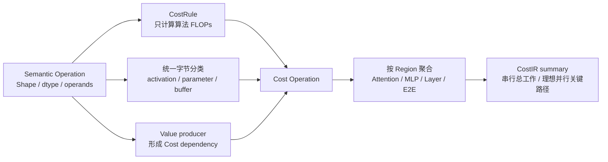

# CostIR 公式与计算范例

> 一句话：Cost Lowerer 把 concrete-shape SemanticIR 转成硬件无关的算法工作量、逻辑 Tensor 数据量、物化数据量、状态占用和依赖上下界，而不预测任何设备时延。

## 方法流程



每条 Cost Operation 都保留：Semantic Node ID、Stable Path、输入/输出 Shape、依赖节点、Formula Rule ID、公式假设、各类 bytes 和 Derivation Record。用户可以从 E2E 总量下钻到 Layer、Attention/MLP，再到单个算子及公式。

## FLOPs 约定

| 操作 | 公式 | 本项目约定 |
|---|---|---|
| MatMul | `2 × batch × M × N × K` | 乘法和加法各计 1 FLOP |
| Add | `output_elements` | 广播不改变输出元素数 |
| Mul | `output_elements` | 标量或 Tensor 乘法均每输出元素计 1 |
| RMSNorm | `outer × (4H + 2)` | square、reduce、divide、epsilon、rsqrt、normalize 与 weight multiply 显式计数；divide/rsqrt 各视为 1 个等价 FLOP |
| Softmax | `outer × (5N - 2)` | max、subtract、exp、sum、divide；comparison/exp 各视为 1 个等价 FLOP |
| SiLU | `5 × elements` | negate、exp、add、divide、multiply 各计 1 |
| View / Transpose | `0` | 只改变 metadata/layout，保持 alias，不物化 |

这些是版本化的算法计数约定，不等于某个 kernel 的指令数。硬件 Backend 可以选择 fused kernel，但不得静默改写基础 CostIR。

## 字节口径

| 字段 | 含义 | 能否当作峰值内存 |
|---|---|---|
| `logical_read_bytes` | 每个 operand Tensor 的逻辑存储大小求和，每个 operand 位置计一次；不是 cache/DRAM traffic | 否 |
| `logical_write_bytes` | 每个 result Tensor 的逻辑大小；alias result 也保留，便于理解 Shape | 否 |
| `materialized_read/write_bytes` | 本操作实际需要触碰/新建存储的基线口径；View/Transpose 为 0 | 否 |
| `parameter_read_bytes` | 本次调用读取的 parameter Tensor 逻辑大小 | 否 |
| `buffer_read_bytes` | 本次调用读取的非参数 Buffer，例如 causal mask | 否 |
| `explicit_activation_bytes` | 所有非 alias 操作产生的 activation bytes 累计量 | 否 |
| `alias_result_bytes` | View/Transpose 暴露的逻辑 result 大小，但不新增存储 | 否 |
| `parameter_bytes` / `buffer_bytes` | 去重后的逻辑状态占用 | 是峰值 live-set 的组成部分，但仍需生命周期分析 |

峰值显存/内存必须在后续基于 Value 生命周期、复用、allocator 与 Backend 物化选择计算，不能拿累计读写量冒充。

## 计算范例：第一层 Q projection

输入：

- activation：`[B=1, S=512, H=512]`，FP32；
- weight：`[H=512, H=512]`，FP32；
- 输出：`[1, 512, 512]`，FP32。

计算：

```text
FLOPs
= 2 × B × S × H(output) × H(reduction)
= 2 × 1 × 512 × 512 × 512
= 268,435,456

activation bytes = 1 × 512 × 512 × 4 = 1,048,576
weight bytes     = 512 × 512 × 4     = 1,048,576
logical read     = 2,097,152 bytes
logical write    = 1,048,576 bytes
parameter read   = 1,048,576 bytes
```

输出：Cost Operation 带 `rule_id=core.cost-rule.matmul/v1alpha1`，上述 concrete expression、输入/输出 Shape、parameter State Artifact ID，以及指向前序 Value producer 的依赖。

## 单层与两层结果

| 指标 | 单层 | 两层 E2E |
|---|---:|---:|
| FLOPs | 4,855,425,024 | 9,710,850,048 |
| logical read bytes | 92,278,784 | 184,557,568 |
| logical write bytes | 69,206,016 | 138,412,032 |
| materialized read bytes | 83,890,176 | 167,780,352 |
| materialized write / explicit activation bytes | 60,817,408 | 121,634,816 |
| parameter read bytes | 16,781,312 | 33,562,624 |
| buffer read bytes | 1,048,576 | 2,097,152 |
| alias result bytes | 8,388,608 | 16,777,216 |

两层去重状态占用：parameter `33,562,624 B`，causal-mask buffer `2,097,152 B`，Workload 输入/输出 Artifact 合计 `2,097,152 B`。

## 串行与理想并行上下界

CostIR 从 Typed Value producer 建立依赖。对 FLOPs：

```text
串行总工作 = 所有 Cost Operation FLOPs 之和
理想并行关键路径 = 每个节点 FLOPs + max(所有依赖的累计 FLOPs)
```

本例串行总工作为 `9,710,850,048 FLOPs`；假设无限并行资源、Q/K/V 与 gate/up 分支可完全重叠时，关键路径为 `6,489,624,576 FLOPs`。这只是算法工作上下界，不是时延预测；真实并行度、kernel 串并行、资源冲突、内存带宽和调度空泡由 Execution/Schedule 层计算。

## 解决的问题

- 同一个总量可以沿 Region 下钻，避免“E2E 不准但不知道哪一层错”。
- 参数状态、累计访问量、显式 activation 与 alias 分开，避免把不同口径混成显存峰值。
- CostRule 可替换并带版本/provenance，新算子可接入而不修改调用方编排。
- CostIR 不含 CPU/MPS placement；同一逻辑模型可复用于不同硬件 Backend 和方案对比。
