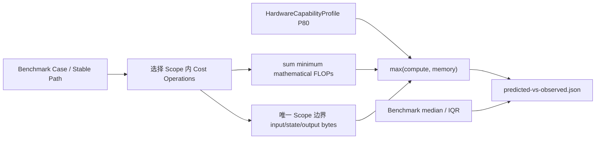

# 预测—硬件地板—实测对照

> 一句话：同一 Benchmark Scope 同时展示算法无关经验硬件地板、未来的实现预测和当前 Observation；地板与实测的距离表示优化空间，只有实现预测与实测之间才计算预测误差。

## 三类数值不能混用

| 数值 | 回答的问题 | 能否计算 prediction error |
|---|---|---|
| Empirical hardware floor | 跨越当前算子/算法后，硬件至少不可能快于什么边界？ | 否；只能计算 Observation/Floor headroom |
| Implementation/schedule prediction | 指定 kernel、融合、布局和调度后预计多慢？ | 可以，前提是口径和 validity domain 一致 |
| Observation | 当前软件栈和环境实际发生了什么？ | 是比较基准，不会被校准覆盖 |

## Scope 对齐和聚合



模块和 E2E 不再把逐算子 memory floor 简单求和。Comparator 使用后端预先生成
的 `ScopeDurationBounds`：

```text
T_compute(scope) = sum(minimum FLOPs in scope) / compute P80
T_memory(scope)  = unique boundary compulsory bytes / memory P80
T_floor(scope)   = max(T_compute, T_memory)
headroom_ratio   = observed median / T_floor
```

View/Transpose 的 alias storage 不重复计数；同一个参数被 Scope 内多个操作读取时，
作为 compulsory state 只计一次。当前实现的中间 materialization 不进入硬件地板。

## 输出语义

每个 `latency_cases[]` 同时包含：

```yaml
predicted:
  kind: algorithm-independent-empirical-hardware-floor
  minimum_work_flops: 9710850048
  compulsory_bytes: 37756928
  empirical_compute_time_ns: 5553975.963
  empirical_memory_time_ns: 297691.065
  empirical_hardware_floor_ns: 5553975.963
  limiting_resource: compute.fp32
  full_duration_ns: null
observed:
  kind: benchmark-median
  median_ns: 92814479.0
comparison:
  observed_to_hardware_floor_ratio: 16.711
  relative_prediction_error: null
  error_status: not-evaluable-hardware-floor
```

`relative_prediction_error=null` 是刻意的语义约束：硬件地板不是当前实现的点预测。
未来 Implementation Candidate Duration Model 可增加独立的 predicted duration 和
error，但不得覆盖这组 floor/headroom 字段。

## 当前两层样例

| Case | Floor | Observation | Headroom |
|---|---:|---:|---:|
| Q projection | 0.153528 ms | 0.154288 ms | 1.005× |
| RMSNorm | 0.016551 ms | 0.062993 ms | 3.806× |
| Softmax | 0.132278 ms | 0.699458 ms | 5.288× |
| Transformer layer | 2.776988 ms | 45.059563 ms | 16.226× |
| Two-layer prefill | 5.553976 ms | 92.814479 ms | 16.711× |

该次 E2E `IQR/median=2.41%`，但第一层 module 为 `3.42%` 且测量前环境门禁
不合格，所以整次 Run 只能作为功能穿刺，
不能进入 trusted calibration。所有数值、环境原因和 raw windows 仍保留在 Run
Bundle，网页报告会明确显示这是“算法无关硬件地板”，避免误读成完整预测。

## 内存对照仍是独立指标

内存沿用同口径 framework Tensor storage：

```text
predicted = parameter + buffer + semantic peak live activation
observed  = forward-hook 边界去重后的 live Tensor storage peak
```

本轮为 `54,534,144 B` 对 `69,214,208 B`，预测少 `14,680,064 B`，绝对相对差
`21.21%`。这属于 live-set/框架归因模型，不应用耗时能力包络进行修正。

## 查看入口

```sh
uv run groundupscale verify-run \
  .groundupscale/runs/m4-cpu-envelope-20260807-v2 --json

uv run groundupscale explain \
  .groundupscale/runs/m4-cpu-envelope-20260807-v2 --json

open .groundupscale/runs/m4-cpu-envelope-20260807-v2/reports/report.html
```

Explanation Graph 为每个 Scope 连接 minimum work、compulsory bytes、P80 能力来源、
限制资源、Benchmark Observation、Cost Operation 和 Stable Path，支持从 E2E 逐层
下钻。
