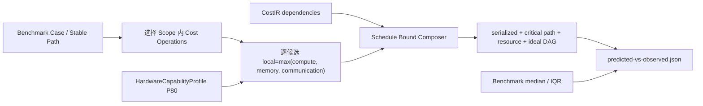

# 预测—硬件地板—实测对照

> 一句话：同一 Benchmark Scope 同时展示算法无关经验硬件地板、未来的实现预测和当前 Observation；地板与实测的距离表示优化空间，只有实现预测与实测之间才计算预测误差。

面向迭代的中文报告格式、非空 Report Value、A–D Evidence Grade、两侧 TOP10 与 E2E contribution 规则由[中文预测—实测迭代报告规范](prediction-observation-report.md)定义。该报告层不改变本文件中的权威数值、Frontier promotion 或 prediction-error 门禁。

## 三类数值不能混用

| 数值 | 回答的问题 | 能否计算 prediction error |
|---|---|---|
| Empirical hardware floor | 跨越当前算子/算法后，硬件至少不可能快于什么边界？ | 否；只能计算 Observation/Floor headroom |
| Exploratory provisional estimate | 当精确 phase 类型已覆盖但证据环境不合格时，预估的串行数值是多少？ | 否；只供规划，不产生诊断 Verdict |
| Exact-Shape Operator Frontier | 同一执行域/cohort 下，正确且独立 holdout 的声明候选实现已证明可达多快？ | 否；计算 Frontier Efficiency，不计算 prediction error |
| Implementation/schedule prediction | 指定 kernel、融合、布局和调度后预计多慢？ | 可以，前提是口径和 validity domain 一致 |
| Observation | 当前软件栈和环境实际发生了什么？ | 是比较基准，不会被校准覆盖 |

## Scope 对齐和聚合



Comparator 使用后端预先生成的 `ScopeDurationBounds`。对于当前
`serialized-unfused` CPU 参考：

```text
T_local_i      = max(minimum FLOPs_i / compute P80,
                     materialized bytes_i / memory P80)
T_serialized   = sum_i(T_local_i)
T_critical     = longest dependency path of T_local_i
T_resource     = max_r(sum_i(T_resource_i[r]))
T_ideal_DAG    = max(T_critical, T_resource)
selected_floor = T_serialized only when every compound phase is known
provisional     = sum_phase(max(exact exploratory probe, memory-pattern floor))
                  only when every phase has an exact exploratory capability
planning_leaf_i = exact_Operator_Frontier_i when the exact Stable Path and
                  complete execution-domain identity match; otherwise provisional_i
planning_E2E    = sum_i(planning_leaf_i), always exploratory while any leaf is provisional
headroom_ratio = observed median / selected_floor when selected_floor is known
frontier_efficiency = exact_frontier_latency / observed_latency
```

View/Transpose 的 alias storage 不计物理流量。算子中间结果在未融合调度下必须读写；
只有显式融合 Implementation Candidate 才能用融合边界流量替代这些逐候选流量。

## 输出语义

每个 `latency_cases[]` 同时包含：

```yaml
predicted:
  status: phase-capabilities-incomplete
  kind: algorithm-independent-empirical-serialized-hardware-floor
  minimum_work_flops: 268435456
  compulsory_bytes: 3145728
  materialized_bytes: 3145728
  empirical_compute_time_ns: 153527.6585
  empirical_memory_time_ns: 24802.2063
  schedule: serialized-unfused
  serialized_hardware_floor_ns: 153527.6585
  critical_path_hardware_floor_ns: 153527.6585
  resource_hardware_floor_ns: 153527.6585
  resource_physical_floor_ns: 153527.6585
  ideal_dag_hardware_floor_ns: 153527.6585
  empirical_hardware_floor_ns: 153527.6585
  provisional_estimate_ns: 153527.6585
  provisional_evidence_tier: exploratory
  provisional_reason_codes: [load-above-policy, total-competing-cpu-above-policy]
  operator_achievable_frontier_ns: 154364.57142857142
  operator_frontier_standard_uncertainty_ns: 2612.1308332893736
  operator_frontier_match_status: exact-anchor
  operator_frontier_anchor_ids: [apple-m4-cpu-matmul-512-matmul-q-proj-2.0.0]
  limiting_resource: null
  resource_limiting_resource: compute.fp32
  full_duration_ns: null
observed:
  kind: benchmark-median
  median_ns: 154532.75
  evidence_tier: qualified
  reason_codes: []
comparison:
  observed_to_hardware_floor_ratio: 1.0065466
  operator_frontier_efficiency: 0.9989117
  frontier_efficiency_status: qualified
  operator_frontier_gap_status: within-combined-uncertainty
  operator_frontier_combined_uncertainty_ns: 8156.6867
  operator_frontier_uncertainty_policy:
    policy_id: exact-frontier-observation-combined-uncertainty
    version: 1.0.0
  relative_prediction_error: null
  error_status: not-evaluable-hardware-floor
```

`relative_prediction_error=null` 是刻意的 fail-closed：即使原子 MatMul 的
`empirical_hardware_floor_ns` 有数，它仍是 Resource Physical Floor 而不是点预测。
含 Softmax/RMSNorm 的 compound scope 还会因为精确 phase capability 不完整而让
selected duration 保持 `null`；通用 `resource_physical_floor_ns` 不得冒充 selected
或 headroom。未来全部 phase 有受信证据后才可恢复 compound selected duration；
Implementation Candidate Duration Model 仍可增加独立点预测和 error，但不得
覆盖 Physical Floor。

`provisional_estimate_ns` 不会填写 `empirical_hardware_floor_ns`，也不会
触发 `relative_prediction_error`、Frontier 、校准或 Verdict。报告可以展示
探索性 Top 10、实测/降级预估倍率和 phase 下钻，但必须显式标记
“非诊断”，禁止产生“最大差异诊断”或结论性语义。预测与实测
的 evidence tier/reason codes 独立保存，不会用一侧的合格状态覆盖另一侧。
Top10 规划表允许逐叶使用已匹配的 exact Frontier 覆盖旧 provisional 值，机器结果
标记为 `mixed-exact-frontier-and-provisional-estimate`。这不会把整个 E2E 晋级为
authoritative，也不会生成 prediction error/Verdict；每行还必须分别标出
`exact-operator-frontier` 或 `exploratory-provisional-candidate-estimate`，以及当前
Benchmark 是否重新通过 Frontier Observation 门禁。

Exact Frontier 只做全字段 exact match；Shape、dtype、layout/stride/alignment、threads、
execution mode、candidate family/binary digest、input corpus、Completion Boundary 或
Hardware Validity Cohort 或 exact Stable Path 任一不一致均 structured `unknown`，
不做 nearest/P80/跨 cohort 回退。Frontier Efficiency 等于同 work 下的有效能力比，
因此用 `frontier_latency / observed_latency` 计算。它可以略高于 100%；gap 判定使用
版本化 RSS combined uncertainty，将 Anchor holdout 标准不确定度、当前 Observation
IQR 半宽、六 session 资格策略的 5% repeatability bound 与 timer resolution 分项保存。
只有当差距超过 combined uncertainty 才标记为可能的新更快 observation，并且仍需重新走资格化，
不会由一次快样本直接改写 ACTIVE Anchor。

## 当前 512³ MatMul exact Frontier 样例

最终 Run `m4-cpu-exact-frontier-prediction-observation-20260810-v5` 的 17 个
artifact digest 全部通过，环境门禁为 `passed`：

| Case | Physical Floor | Exact Frontier | Anchor uncertainty | Combined uncertainty | Observation | Frontier Efficiency | 判定 |
|---|---:|---:|---:|---:|---:|---:|---|
| Q projection | 0.153528 ms | 0.154365 ms | 0.002612 ms | 0.008157 ms | 0.154533 ms | 99.891% | within-combined-uncertainty |

这说明该 Demo 的典型 MatMul 已不再拿全局 P80 地板冒充预测：报告能直接回答
“当前实现相对同 Shape、同执行域、同 cohort 的已验证可达水平有多接近”。当前答案
是当前运行与已验证 best-observed Frontier 只差 `0.168 μs`（约 `0.109%`），
远小于 `8.157 μs` combined uncertainty；当前证据支持“该 exact-Shape Frontier
能复现当前典型调用”，不支持存在显著 headroom。这不是 prediction error，也不自动
外推为其他节点的点预测。它仍只覆盖 layer_0/q_proj 的
`C0_SINGLE torch.matmul.cpu.fp32`，不扩展到 layer_1、
RMSNorm/Softmax、其他 MatMul Shape、其他线程数或整个 layer/E2E。

## 用户关注的 Top-5 MatMul 热点接入结果

最终 Run `m4-cpu-top5-exact-frontier-prediction-observation-20260810-v4`
含 17 个 digest-valid artifact。预测侧是逐 Stable Path 的混合规划值；实测侧同时
保留重复 Benchmark 中位数和带诊断插桩的单次 Trace，二者不能互相冒充：

| Stable Path（省略公共前缀） | Top10 规划值 | 单次 Trace | 重复 Benchmark | 本次 Observation / Anchor |
|---|---:|---:|---:|---|
| `layer_0/mlp/gate_proj` | 0.612814 ms | 1.235833 ms | 0.827398 ms | unqualified（IQR 9.245%）；历史跨会话约 0.666/0.832 ms，Frontier 未晋级 |
| `layer_0/attention/qk_matmul` | 0.153204 ms | 1.031917 ms | 0.566281 ms | unqualified（IQR 5.505%）；独立 holdout 约 0.543/0.577 ms，跨会话超过 5%，Frontier 未晋级 |
| `layer_1/attention/qk_matmul` | **0.580157 ms exact Frontier** | 1.024958 ms | 0.589726 ms | Anchor 仍为 QUALIFIED+ACTIVE；本次 Observation 因 IQR 5.322% 降级，不计算 Efficiency |
| `layer_1/mlp/gate_proj` | 0.612814 ms | 1.531458 ms | 0.829622 ms | unqualified（IQR 3.300%）；历史跨会话约 0.664/0.829 ms，Frontier 未晋级 |
| `layer_0/attention/context_matmul` | **0.304768 ms exact Frontier** | 0.611500 ms | **0.312588 ms** | **QUALIFIED current Observation；Anchor 为 QUALIFIED+ACTIVE** |

两条 ACTIVE Anchor 在 v4 中的逐 case、同口径复核为：

| Case | Exact Frontier | Anchor uncertainty | Current Benchmark | Combined uncertainty | Frontier Efficiency | 判定 |
|---|---:|---:|---:|---:|---:|---|
| layer 1 QK MatMul | 0.580157 ms | 0.002007 ms | 0.589726 ms | N/A | N/A | current Observation timing-statistics-invalid |
| layer 0 Context MatMul | 0.304768 ms | 0.006099 ms | 0.312588 ms | 0.016787 ms | 97.498% | within-combined-uncertainty |

因此，“接回预测后端”不等于把五个数全部强行采纳：后端保存两条完整命中
Shape、operand/result layout 与 stride、candidate/input/execution digest、HVC、正确性、
3+3 独立会话和 timing 门禁的 Stable Path exact Frontier；但每次报告还要重新校验
当前 Observation。v4 只有 Context MatMul 重过当前门禁，layer-1 QK 的 Anchor 未被
撤销、当前比较却降级为 N/A。另外三条继续展示估计值，但证据级别保持
provisional/unknown。Top10 Trace 的额外耗时包括诊断插桩，可信 Frontier 复现结论
以重复 Benchmark 为准。

## Top 10 是报告生成门禁

只要生成预测—实测 comparison，构建器就必须同时消费 Hardware Backend candidates
和 Observation Trace，写出 `latency_decomposition`：

- 预测侧按所选 `serialized-unfused` 调度对候选局部地板排序；
- CPU 实测侧按单次同步诊断 Trace 的互斥 operation leaves 排序，并显式加入
  `unattributed://host-runtime`；
- 两侧分别选择 Top 10，再并入所有达到本侧 E2E 10% 的项；
- 联合表取两侧 selected Stable Path 的并集，不让一侧排名隐藏另一侧热点；
- 预测用 candidate sum 回收，实测用 leaf interval union、overlap、unattributed 和
  other 回收；
- 单次 Trace Top 10 与重复 Benchmark 中位数并列标注，不能互相冒充。

如果设备 Trace 只记录异步 host enqueue、缺少可比 device duration，报告必须保留
该区块并显示缺失证据，不能静默省略。Run Bundle 测试会检查两侧 Top 10、联合差异、
最大差异下钻和时间回收区块。

## 当前两层 exploratory 样例

Run `m4-cpu-phase-provisional-prediction-observation-20260809-v2` 由最终
代码生成，17 个 artifact 的 digest 全部校验通过：

| Case | Resource Physical Floor | Authoritative selected | Exploratory provisional | Observation | Obs/Provisional | Evidence |
|---|---:|---:|---:|---:|---:|---|
| Q projection | 0.153204 ms | 0.153204 ms | 0.153204 ms | 0.154135 ms | 1.006x | prediction/observation exploratory |
| RMSNorm | 0.017516 ms | unknown | 0.057280 ms | 0.063072 ms | 1.101x | prediction/observation exploratory |
| Softmax | 0.139988 ms | unknown | 0.691694 ms | 0.706800 ms | 1.022x | prediction/observation exploratory |
| Transformer layer | 3.448888 ms | unknown | 4.080123 ms | 8.303479 ms | 2.035x | prediction/observation exploratory |
| Two-layer prefill | 6.897775 ms | unknown | 8.160245 ms | 16.681188 ms | 2.044x | prediction/observation exploratory |

RMSNorm 和 Softmax 的数值不再留白，但 authoritative selected 仍为
`unknown`。该次 RMSNorm `IQR/median=4.98%`、Softmax `4.75%`、E2E
`1.56%`。测量前 normalized load 为 `0.3416 > 0.25`，competing CPU
为 `0.1707 > 0.10`，所以预测 Profile 和 Observation 都是 exploratory，
不能进入 trusted calibration。

Softmax 的 0.691694 ms 按串行 phase 回收为
`max_reduce 0.051987 + subtract 0.116069 + exp 0.356380 +`
`sum_reduce 0.048190 + normalize 0.119068 ms`。RMSNorm 的 0.057280 ms
回收为 `square 0.015116 + reduce_sum 0.006024 + mean_scale 0.000181 +`
`epsilon_add 0.000165 + rsqrt 0.000138 + input_scale 0.017829 +`
`weight_scale 0.017829 ms`。任两个相依 phase 都不发生隐式重叠。

## 内存对照仍是独立指标

内存沿用同口径 framework Tensor storage：

```text
predicted = parameter + buffer + semantic peak live activation
observed  = forward-hook 边界去重后的 live Tensor storage peak
```

本轮为 `54,534,144 B` 对 `69,214,208 B`，预测少 `14,680,064 B`，绝对相对差
`21.21%`。这属于 live-set/框架归因模型，不应用耗时能力包络进行修正。

## 查看入口

```sh
uv run groundupscale verify-run \
  .groundupscale/runs/m4-cpu-phase-provisional-prediction-observation-20260809-v2 --json

uv run groundupscale explain \
  .groundupscale/runs/m4-cpu-phase-provisional-prediction-observation-20260809-v2 --json

open .groundupscale/runs/m4-cpu-phase-provisional-prediction-observation-20260809-v2/reports/report.html

open .groundupscale/runs/m4-cpu-exact-frontier-prediction-observation-20260810-v5/reports/report.html

open .groundupscale/runs/m4-cpu-top5-exact-frontier-prediction-observation-20260810-v4/reports/report.html
```

Explanation Graph 为每个 Scope 连接局部候选、依赖关键路径、共享资源负载、所选
调度、P80 能力来源、Benchmark Observation、Cost Operation 和 Stable Path，支持
从 E2E 逐层下钻。
