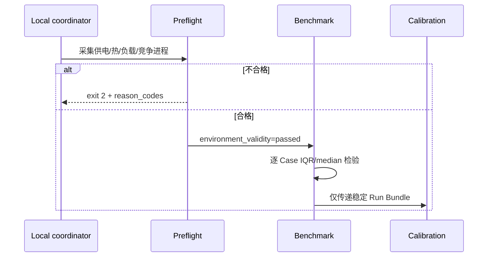
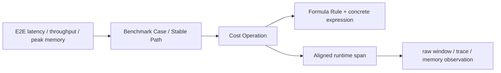

# 本地 Apple M4 运行与校准手册

> 一句话：公共 CI 只验证确定性软件；真实 CPU/MPS 计时、trace 和校准只在受信任的本地 Mac 上显式运行，并用不可变 Run Bundle 留证。

## 1. 从干净 checkout 建立环境

要求 Apple Silicon Mac、Python 3.11 与 `uv 0.11.14`。不修改系统 Python。

```sh
git clone https://github.com/Kirrito-k423/GroundUpScale.git
cd GroundUpScale
uv sync --locked --group dev
uv run pytest -q
```

非 Mac 公共 CI 会跳过一条真实 MPS correctness 测试；Schema、四层 IR、Cost 公式、CPU reference、Run Bundle、trace、calibration governance 仍全部执行。

## 2. 先检查当前环境是否允许测量

```sh
uv run groundupscale preflight --json
```

退出码 `0` 表示可以开始可信测量，`2` 表示当前环境不合格。
`local-apple-silicon-v2` policy 固定检查：

- Darwin/arm64 且使用交流供电；
- `pmset` 报告无 thermal/performance warning，未知状态也拒绝；
- `1 min load average / logical CPU count <= 0.25`；
- 连续 3 个 1 秒样本中，coordinator 及其祖先进程以外的全部进程 CPU 总和，
  按 `100 * logical CPU count` 归一化后的最大值不超过 `0.10`。

每个进程的采样峰值仍在 `top` 和
`maximum_single_process_cpu_percent` 中保留用于定位，但不单独决定资格。v1 的
单进程 `25%` 门禁已被 v2 取代：它会把 10 核机器上一次约半个单核的 UI 活动
误判为持续竞争，而 v2 直接约束整机竞争容量。缺少逐窗口总量样本时仍 fail closed。

报告只记录 PID、进程名和 CPU 百分比等 allowlist 字段，不记录命令参数、
环境变量或文件路径。不要让脚本自动杀进程；退出计算任务、等待索引/照片分析
结束和 load average 回落后重新执行。preflight 通过只是采样前置条件，Run 内
每个 Case 的 `IQR / median <= 3%` 仍是独立硬门禁。



### 2.1 构造 M4 CPU 硬件能力包络

```sh
uv run groundupscale benchmark-hardware \
  specs/microbenchmarks/apple-m4-cpu.yaml \
  --repository-root . \
  --observation-output goal_process/mac-transformer-ir-calibration-slice/evidence/apple-m4-cpu-microbenchmark-observation-v2.json \
  --profile-output specs/hardware-capabilities/apple-m4-cpu-local.yaml \
  --profile-name apple-m4-cpu-local \
  --require-valid-environment --json
```

Suite 对 scalar/vector/matrix、memory copy/triad 各运行 12 个 Shape，保留对齐/
非对齐边界、线程数和 raw samples。每个 Shape 先取最好的稳定线程结果，再计算
P80/P95；Profile 用 raw observation SHA-256 锁定来源。

正式 CI/能力晋升必须保留 `--require-valid-environment`。只想验证链路时可以去掉，
但产出的 `environment.eligible=false` Profile 只能作 exploratory evidence，后端和
Explanation Graph 会保留该标记。Apple 官方能力仍只写在
`specs/hardware/apple-m4.yaml`，实测能力不会覆盖它。

## 3. 只改 YAML 选择 CPU 或 MPS

```sh
uv run groundupscale compile specs/plans/mac-cpu-prefill.yaml \
  --repository-root . --output /tmp/groundupscale-compile --json

uv run groundupscale run specs/plans/mac-mps-prefill.yaml \
  --repository-root . --run-id my-mps-run \
  --target-window-ms 100 --windows-per-sample 9 \
  --require-valid-environment --json
```

CPU/MPS 由 AnalysisPlan 引用的 DeploymentIntent 决定；CLI 不接受一个会覆盖 YAML placement 的 `--device` 开关。MPS runner 检测到 `PYTORCH_ENABLE_MPS_FALLBACK=1` 会拒绝执行。

CPU Plan 还显式引用 `HardwareCapabilityProfile`。如需在环境不合格时仅做功能穿刺，
同时记录而不强制拒绝环境，可使用：

```sh
uv run groundupscale run specs/plans/mac-cpu-prefill.yaml \
  --repository-root . --run-id exploratory-cpu \
  --collect-environment --json
```

正式协议只适用于当前固定 Shape：operator 用 10-call pilot 选择约 100 ms 的 raw window，module/E2E 每 window 调用一次；20 个 sample 各取 9 个 raw window 的 median。每个 raw window 都进入 Bundle，不删除异常点。

## 4. 检查和下钻

```sh
uv run groundupscale verify-run .groundupscale/runs/my-mps-run --json
uv run groundupscale explain .groundupscale/runs/my-mps-run
open .groundupscale/runs/my-mps-run/reports/report.html
```

下钻关系：



Benchmark 是 headline 真值；trace 带 forward hooks，只用于定位。MPS leaf span 是 host enqueue 时间，不冒充 device kernel duration。Error Attribution 永远保留未归因桶。

## 5. Run Bundle 组织

```text
.groundupscale/runs/<run-id>/
├── run.manifest.json
├── resolved/              # 输入锁与环境 allowlist
├── ir/                    # Model/Workload/Semantic/Cost IR
├── prediction/            # Cost/live-set 与 Explanation Graph
├── observation/           # raw benchmark、JSONL trace、alignment、memory、correctness
├── comparison/            # Error Attribution
└── reports/report.html
```

Manifest 记录每个 artifact 的 role、Schema、producer、inputs 与 SHA-256。writer 拒绝覆盖既有 Run ID；重新测量必须创建新 ID。
可信运行还会把完整 preflight 写入 `resolved/environment.json`，并在 Manifest
记录 `environment_validity: passed`；`hardware_cohort` 同时包含 environment
policy ID，避免不同测量协议被混为同一 cohort。没有该状态的 Bundle 不能进入
校准。

## 6. 受控校准

拟合和留出 Run ID 必须完全分离：

```sh
uv run groundupscale fit-calibration \
  --run-bundle .groundupscale/runs/fit-01 \
  --run-bundle .groundupscale/runs/fit-02 \
  --output .groundupscale/calibration/candidate.yaml --json

uv run groundupscale validate-calibration \
  .groundupscale/calibration/candidate.yaml \
  --run-bundle .groundupscale/runs/holdout-01 \
  --run-bundle .groundupscale/runs/holdout-02 \
  --run-bundle .groundupscale/runs/holdout-03 \
  --run-bundle .groundupscale/runs/holdout-04 \
  --run-bundle .groundupscale/runs/holdout-05 \
  --output .groundupscale/calibration/validation.json --json
```

Profile 精确锁定 device、硬件 cohort、CostIR fingerprint、Case 集、thread 数和 instrumentation profile。fit 证据有任一 Case 噪声超过 3%会被拒绝；holdout 噪声超标则隔离，至少需要 5 份有效 holdout。只有全部有效留出的逐 Case latency 与 Tensor-storage memory 误差不超过 5%，`promote-calibration` 才允许生成 active profile。

## 7. 当前实测限制

2026-08-06 的 C012–C018 证明：单次 Run 常能满足 3%，有效 MPS holdout 的最大校准误差也只有 3.71%，但连续采集时后台/调度噪声会使部分 Run 超过 3%。C018 的 7 个 MPS holdout 只有 3 个有效，因此 Profile 没有晋升。CPU C017 同样有 Softmax 3.38% 的噪声失败。

这不是公式误差失败，而是测量有效性失败。现在已有显式 preflight 防止继续
无条件采样：2026-08-06 首次真实检查识别到归一化 1 分钟负载 `0.363`、
`mediaanalysisd` 最高 `58.1% CPU`，因此在 benchmark 前拒绝。必须等待环境
满足预注册 policy 后创建全新 fit/holdout cohort；不能把旧的偶然成功 Run
拼入结果。

## 8. 公共 CI 与本机安全边界

- `.github/workflows/compiler-ci.yml` 在 GitHub-hosted Linux runner 上运行，不执行 MPS benchmark。
- 个人 Mac 不注册为公共 PR 的通用 self-hosted runner。
- `scripts/run-local-m4-evidence.sh <tag>` 只由本机用户对已信任代码手动执行；不上传环境变量或凭证。
- 环境 artifact 使用 allowlist；Run Bundle 不采集 unrestricted environment dump。
