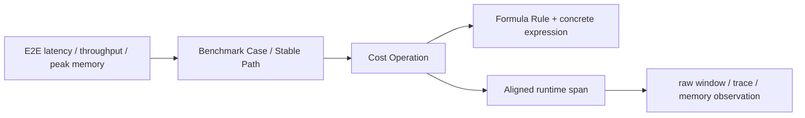

# 本地 Apple M4 运行与校准手册

> 一句话：公共 CI 只验证确定性软件；真实 CPU/MPS 计时、trace 和校准只在受信任的本地 Mac 上显式运行，并用不可变 Run Bundle 留证。

## 1. 从干净 checkout 建立环境

要求 Apple Silicon Mac、Python 3.11 与 `uv 0.11.14`。不修改系统 Python。

```sh
git clone https://github.com/Kirrito-k423/GroundUpScale.git
cd GroundUpScale
uv sync --locked --group dev
uv run pytest -q
```

非 Mac 公共 CI 会跳过一条真实 MPS correctness 测试；Schema、四层 IR、Cost 公式、CPU reference、Run Bundle、trace、calibration governance 仍全部执行。

## 2. 只改 YAML 选择 CPU 或 MPS

```sh
uv run groundupscale compile specs/plans/mac-cpu-prefill.yaml \
  --repository-root . --output /tmp/groundupscale-compile --json

uv run groundupscale run specs/plans/mac-mps-prefill.yaml \
  --repository-root . --run-id my-mps-run \
  --target-window-ms 100 --windows-per-sample 9 --json
```

CPU/MPS 由 AnalysisPlan 引用的 DeploymentIntent 决定；CLI 不接受一个会覆盖 YAML placement 的 `--device` 开关。MPS runner 检测到 `PYTORCH_ENABLE_MPS_FALLBACK=1` 会拒绝执行。

正式协议只适用于当前固定 Shape：operator 用 10-call pilot 选择约 100 ms 的 raw window，module/E2E 每 window 调用一次；20 个 sample 各取 9 个 raw window 的 median。每个 raw window 都进入 Bundle，不删除异常点。

## 3. 检查和下钻

```sh
uv run groundupscale verify-run .groundupscale/runs/my-mps-run --json
uv run groundupscale explain .groundupscale/runs/my-mps-run
open .groundupscale/runs/my-mps-run/reports/report.html
```

下钻关系：



Benchmark 是 headline 真值；trace 带 forward hooks，只用于定位。MPS leaf span 是 host enqueue 时间，不冒充 device kernel duration。Error Attribution 永远保留未归因桶。

## 4. Run Bundle 组织

```text
.groundupscale/runs/<run-id>/
├── run.manifest.json
├── resolved/              # 输入锁与环境 allowlist
├── ir/                    # Model/Workload/Semantic/Cost IR
├── prediction/            # Cost/live-set 与 Explanation Graph
├── observation/           # raw benchmark、JSONL trace、alignment、memory、correctness
├── comparison/            # Error Attribution
└── reports/report.html
```

Manifest 记录每个 artifact 的 role、Schema、producer、inputs 与 SHA-256。writer 拒绝覆盖既有 Run ID；重新测量必须创建新 ID。

## 5. 受控校准

拟合和留出 Run ID 必须完全分离：

```sh
uv run groundupscale fit-calibration \
  --run-bundle .groundupscale/runs/fit-01 \
  --run-bundle .groundupscale/runs/fit-02 \
  --output .groundupscale/calibration/candidate.yaml --json

uv run groundupscale validate-calibration \
  .groundupscale/calibration/candidate.yaml \
  --run-bundle .groundupscale/runs/holdout-01 \
  --run-bundle .groundupscale/runs/holdout-02 \
  --run-bundle .groundupscale/runs/holdout-03 \
  --run-bundle .groundupscale/runs/holdout-04 \
  --run-bundle .groundupscale/runs/holdout-05 \
  --output .groundupscale/calibration/validation.json --json
```

Profile 精确锁定 device、硬件 cohort、CostIR fingerprint、Case 集、thread 数和 instrumentation profile。fit 证据有任一 Case 噪声超过 3%会被拒绝；holdout 噪声超标则隔离，至少需要 5 份有效 holdout。只有全部有效留出的逐 Case latency 与 Tensor-storage memory 误差不超过 5%，`promote-calibration` 才允许生成 active profile。

## 6. 当前实测限制

2026-08-06 的 C012–C018 证明：单次 Run 常能满足 3%，有效 MPS holdout 的最大校准误差也只有 3.71%，但连续采集时后台/调度噪声会使部分 Run 超过 3%。C018 的 7 个 MPS holdout 只有 3 个有效，因此 Profile 没有晋升。CPU C017 同样有 Softmax 3.38% 的噪声失败。

这不是公式误差通过，而是测量有效性失败。当前必须选择更受控的运行环境或经 Goal 变更调整统计口径；不能挑历史成功 Run 拼出结果。

## 7. 公共 CI 与本机安全边界

- `.github/workflows/compiler-ci.yml` 在 GitHub-hosted Linux runner 上运行，不执行 MPS benchmark。
- 个人 Mac 不注册为公共 PR 的通用 self-hosted runner。
- `scripts/run-local-m4-evidence.sh <tag>` 只由本机用户对已信任代码手动执行；不上传环境变量或凭证。
- 环境 artifact 使用 allowlist；Run Bundle 不采集 unrestricted environment dump。
