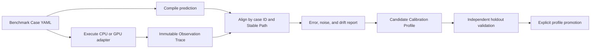
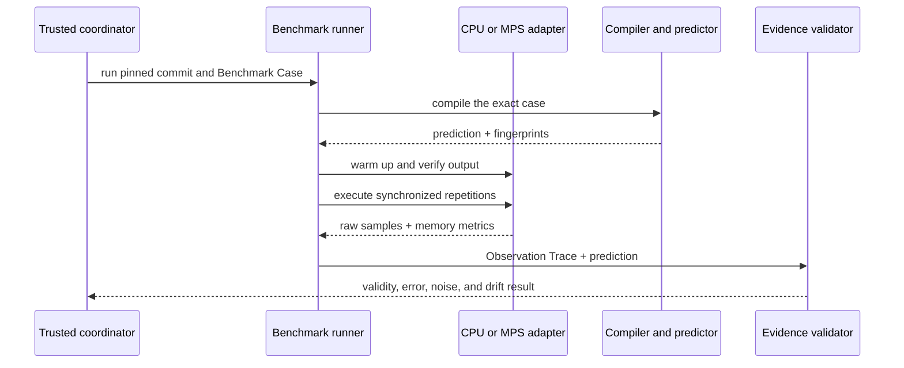
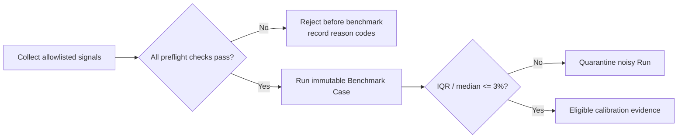

# Hardware measurement and calibration CI

> **In one sentence:** GroundUpScale keeps public compiler checks deterministic,
> collects real measurements only in trusted hardware cohorts, and promotes
> calibration changes through independent validation rather than silent updates.

Detailed module, operator, runtime, and schedule observation follows the
[instrumentation and trace-alignment contract](instrumentation-and-trace-alignment.md).
All generated inputs and evidence are packaged according to the
[Run Bundle layout](../reference/workspace-and-run-bundle.md).

## Four validation lanes

| Lane | Environment | Primary responsibility | Gate |
|---|---|---|---|
| Compiler CI | ordinary GitHub-hosted runner | Schema, canonical IR, invariants, formulas, property tests | every pull request |
| Hardware correctness | trusted CPU/GPU worker | numerical correctness, backend availability, fallback detection | trusted main and release runs |
| Hardware observation | one pinned Hardware Cohort | timing, memory, noise, environment and trace collection | evidence production |
| Calibration promotion | ordinary CI plus reviewed evidence | fitting, holdout evaluation, Error Budgets and drift | explicit approval |

The first lane proves deterministic software behavior. The remaining lanes add
hardware evidence without making an inherently noisy benchmark a universal pull
request gate.

## Evidence loop



A real measurement never overwrites a Base Prediction or active Calibration
Profile. A Calibration Run may fit a Candidate Calibration Profile, but only a
candidate that passes its declared holdout Error Budgets and review policy can
become active.

## Hardware capability-envelope gate

Hardware capacity measurement is a separate lane from operator calibration:

```text
HardwareBenchmarkSuite YAML
  -> scalar/vector/matrix/memory probes
  -> >=10 distinct aligned/non-aligned Shapes per promoted probe
  -> per-Shape median and IQR gate
  -> P80 robust / P95 optimistic probe envelope
  -> max probe envelope per physical resource
  -> HardwareCapabilityProfile + raw observation SHA-256
```

Compiler CI validates the strict Suite/Profile Schemas, aggregation literals,
minimum Shape coverage, deterministic serialization, and source digest. The
trusted M4 lane additionally requires environment preflight success, enough
stable Shapes, matching hardware/software Cohort, and no P80 drift beyond 10%
from the reviewed baseline. A vendor comparison is enforced only when unit,
operation semantics, dtype, concurrency and bandwidth accounting are comparable.

The profile is keyed by `compute.fp32` or `memory.shared`, not by MatMul,
Softmax, PyTorch, or a kernel name. Probe and implementation identities remain
provenance. This lets the backend calculate an algorithm-independent floor while
operator calibration continues to model implementation efficiency above it.

## Benchmark Case contract

Each Benchmark Case binds:

- the Analysis Plan or lower-level analysis input being measured;
- a target Semantic Region or Stable Path;
- CPU, MPS, or another implementation mode;
- input generation and a numerical correctness oracle;
- warmup, iteration, synchronization, and repetition policies;
- required timing, memory, environment, and trace fields;
- validity conditions and Error Budgets.

The same case is compiled for prediction and executed for observation, which
prevents the predicted and measured paths from silently using different shapes
or modes.

## Observation sequence



## Environment-validity preflight

The trusted local lane executes a versioned, fail-closed preflight before each
benchmark. The current `local-apple-silicon-v2` policy requires:

- Darwin on arm64 and AC power;
- nominal `pmset` thermal and performance status, where unknown is a failure;
- one-minute load divided by logical CPU count no greater than `0.25`;
- the maximum of three one-second samples of total CPU across all processes
  outside the coordinator/ancestor chain, divided by
  `100 * logical CPU count`, no greater than `0.10`.

Per-process peaks remain diagnostic evidence, but do not independently reject a
Run. Missing total samples fail closed. The previous v1 single-process gate was
superseded after it rejected unrelated short UI bursts that consumed less than
10% of whole-machine capacity.



The preflight reduces known environmental interference; it does not prove a
Run is stable and never replaces the per-Case noise gate. The report captures
only allowlisted platform, power, normalized load, thermal flags, and top
process PID/name/CPU fields. It never captures command arguments, environment
variables, or unrestricted paths. A Run Manifest must say
`environment_validity: passed` before either fitting or holdout validation can
read it, and its `hardware_cohort` includes the environment policy ID so that
evidence collected under different measurement protocols cannot be pooled.

An Observation Trace records at least:

- commit, Spec, IR, plugin, rule, and calibration fingerprints;
- machine, operating system, runtime, framework, and backend identity;
- power, thread, fallback, and supported thermal-condition metadata;
- exact shapes, dtypes, execution modes, warmup, and repetitions;
- every raw timing sample plus median, dispersion, and tail summaries;
- process and backend-attributed memory measurements;
- numerical error and measurement validity diagnostics.

## Initial Mac hardware cohort

The initial local cohort is an Apple M4 Mac with a 10-core CPU, 8-core GPU, and
16 GB of unified memory. CPU and GPU allocations draw from the same physical
memory system, so reports must not add process memory and an alleged separate
VRAM capacity as independent resources.

The first adapters should report:

- CPU wall time, process CPU time, configured thread count, and peak RSS;
- MPS synchronized wall time, current allocated memory, driver allocated memory,
  and recommended working-set information where available;
- unified-memory pressure or availability metadata when collection is reliable;
- logical parameter, activation, state, and workspace estimates from the model.

MPS execution is asynchronous, so measurement brackets must synchronize the
device. GPU cases must disable uncontrolled CPU fallback; an unsupported GPU
operation is a compatibility result, not a valid GPU timing sample. Warmup and
multiple repetitions are mandatory, and high-dispersion or environmentally
invalid runs are marked noisy rather than used for calibration.

## Hardware cohort isolation

Observations are comparable only within a Hardware Cohort whose key includes at
least:

```text
hardware identity
operating-system version
runtime and framework versions
backend and implementation mode
precision and relevant flags
thread and synchronization policy
measurement protocol version
```

An M1 hosted runner, a local M4, and a future discrete accelerator therefore
produce separate profiles even when they execute the same Benchmark Case.

## Security topology

The repository is public, so the personal Mac must not be a general self-hosted
runner for pull requests. Public PR jobs use GitHub-hosted runners and execute
only deterministic compiler tests. The local hardware worker runs as a dedicated
low-privilege process, accepts only explicitly trusted main commits or manual
requests, holds no personal secrets, and publishes evidence with narrowly scoped
credentials.

If a managed macOS runner with GPU acceleration is introduced later, it remains
a distinct Hardware Cohort rather than a substitute for the local M4 baseline.

## Gates and promotion

Use different decisions for different evidence:

- Schema, compiler invariant, determinism, and numerical-correctness failures
  are hard failures.
- Unsupported backend operations are explicit compatibility failures or skips,
  never CPU timings mislabeled as GPU results.
- Noisy measurements are quarantined and retried; they do not fit calibration.
- Evidence without a passed environment preflight is rejected before fitting
  or holdout validation.
- Performance drift becomes blocking only when it exceeds its relative,
  absolute, and measured-noise budgets under the cohort's policy.
- Calibration fitting uses a declared training partition and is accepted only
  against an independent validation partition.
- Promotion creates a reviewed, immutable Calibration Profile version and keeps
  the Base Prediction and prior profiles addressable.

## First vertical slice

The initial implementation should prove the complete loop with deliberately
small coverage:

```text
fixed-shape Model Spec
    -> MatMul, Add, and RMSNorm primitive semantics
    -> a two-layer Transformer-like Composite Module
    -> Semantic IR
    -> Cost IR
    -> CPU and MPS candidates
    -> prediction
    -> Observation Trace
    -> error report
    -> Candidate Calibration Profile
```

This slice validates the IR seams, symbolic operation and memory formulas,
backend substitution, evidence identity, and calibration governance before the
project adds distributed strategies or large model catalogs.

## Primary references

- [PyTorch MPS backend](https://docs.pytorch.org/docs/stable/notes/mps.html)
- [PyTorch MPS synchronization](https://docs.pytorch.org/docs/stable/generated/torch.mps.synchronize.html)
- [PyTorch benchmark utilities](https://docs.pytorch.org/docs/stable/benchmark_utils.html)
- [GitHub security guidance for self-hosted runners](https://docs.github.com/en/actions/reference/security/secure-use)
- [GitHub macOS larger runners](https://docs.github.com/en/actions/using-github-hosted-runners/using-larger-runners/running-jobs-on-larger-runners?platform=mac)
