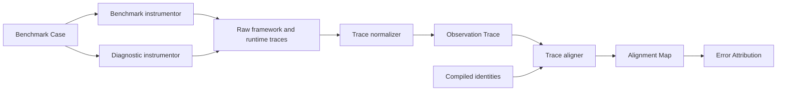
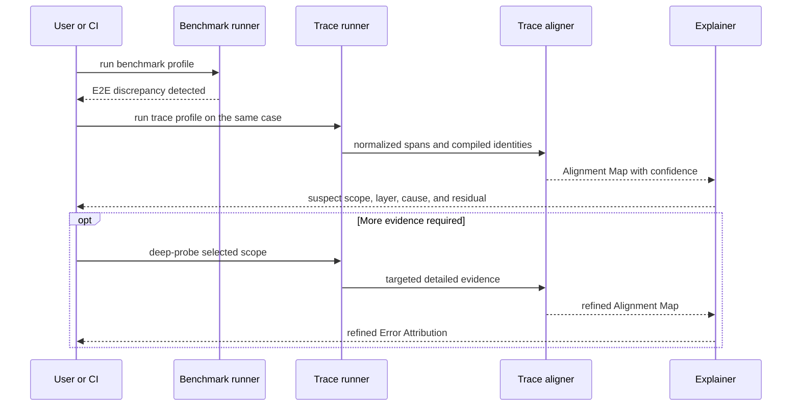

# Instrumentation and trace alignment

> **In one sentence:** GroundUpScale pairs minimally intrusive E2E benchmarks
> with structured diagnostic traces and targeted deep probes, then aligns runtime
> spans to stable compiler identities without treating instrumentation overhead
> as real workload cost.

## Three instrumentation profiles

| Profile | Collection | Purpose |
|---|---|---|
| `benchmark` | synchronization only at measurement boundaries, headline time and memory | trustworthy E2E baseline |
| `trace` | module markers, framework operators, runtime events, shapes and selected memory data | localize a discrepancy |
| `deep-probe` | targeted scope, stacks, detailed device events or counters, optional extra synchronization | explain one suspected cause |

The profiles are normally separate executions of the same Benchmark Case. Each
Observation Trace records the Instrumentation Profile so results collected under
different observer effects are never silently pooled.

## Collection pipeline



Raw profiler output is immutable. Normalization and alignment create new
artifacts with their own Schema versions and provenance.

## Framework hook contract

PyTorch adapters may register forward pre-hooks, forward hooks, and full backward
hooks on selected modules. Hooks:

- resolve the module to a GroundUpScale Stable Path;
- open and close correlation spans;
- capture input and output shape, dtype, logical device, and selected state
  metadata without retaining tensor payloads;
- propagate parent span and iteration identities;
- never mutate inputs or outputs;
- remove all registered handles in `finally` cleanup;
- never perform per-module device synchronization in benchmark mode;
- emit structured events instead of printing one line per operation.

Global hooks add process-wide state and are reserved for controlled diagnostic
runs. PyTorch documents global forward hooks as debugging and profiling tools,
not general execution logic:
[module forward hook documentation](https://docs.pytorch.org/docs/main/generated/torch.nn.modules.module.register_module_forward_hook.html).

## Operator and runtime collection

Hooks cannot observe functional operators, fused kernels, communication,
optimizer internals, data transfer, queueing, or accelerator scheduling by
themselves. The instrumentation module therefore combines:

- explicit `record_function` ranges carrying Stable Path and correlation IDs;
- framework profiler operator events;
- explicit wrappers around optimizer, transfer, checkpoint, publish, and
  communication actions;
- runtime-specific device events and memory counters;
- GroundUpScale Execution IR event IDs when the selected implementation supports
  direct runtime annotation.

PyTorch Profiler can collect operator activity, shapes, memory, stacks, FLOP
estimates for supported operators, and export traces. Its automatic module
hierarchy support is limited in eager mode, so GroundUpScale does not depend on
that feature for identity:
[PyTorch Profiler](https://docs.pytorch.org/docs/stable/profiler.html).

## MPS rules

MPS work is asynchronous. Benchmark mode synchronizes only at the measurement
boundaries, while trace mode uses available events and signposts. MPS profiler
signposts may be viewed in Instruments, but requesting completion after every
encoded operation changes execution behavior and is allowed only for a declared
deep probe:
[MPS profiler start](https://docs.pytorch.org/docs/stable/generated/torch.mps.profiler.start.html).

GPU Benchmark Cases disable uncontrolled CPU fallback. An unsupported MPS
operation becomes a compatibility result or explicit skip, not a CPU sample
labeled as GPU evidence.

## Normalized span contract

Each normalized span or event records as applicable:

```text
span and parent identity
iteration, micro-batch, request, and phase identity
Stable Path and candidate compiled Node/Event IDs
operation or action kind
host timestamps and device timestamps with clock-domain metadata
thread, queue, stream, or worker identity
input and output metadata without payloads
memory allocation, release, and counter observations
instrumentation profile and collector versions
raw-source location and provenance
```

Console output is a bounded human summary. Full-fidelity structured data belongs
in the Run Bundle.

## Alignment Map

Trace alignment proceeds from strongest to weakest evidence:

1. exact injected Execution IR event ID;
2. exact Semantic IR Node ID or Stable Path correlation range;
3. parent scope, operation kind, shape, order, and dependency match;
4. probabilistic structural match with an explicit confidence score;
5. unattributed event or duration when evidence is insufficient.

One compiled event may map to several runtime spans after fusion, chunking, or
library expansion, and several compiled operations may map to one fused kernel.
Alignment is therefore many-to-many and records the match rule rather than
assuming name equality.

## Discrepancy drill-down



The explainer retains separate values for minimally instrumented E2E truth and
diagnostic span detail. It may report estimated instrumentation overhead, but it
does not subtract an assumed overhead and present the result as measured fact.

## Coverage for non-model phases

Model hooks cover only part of training, inference, and RL. Explicit spans are
required for:

- initialization and compilation;
- input preparation, loss, backward, and optimizer steps;
- checkpoint load and save;
- prefill, decode, sampling, and postprocessing;
- data transfer, weight conversion, and version publication;
- queues, services, communication, synchronization, and scheduler decisions.

This ensures an E2E residual cannot disappear merely because it occurred outside
`nn.Module.forward`.

## Validation gates

- Hook installation and removal must be leak-free and exception-safe.
- Benchmark mode must remain free of per-scope device synchronization.
- Every trace declares its collector and Instrumentation Profile.
- Clock domains and synchronization assumptions are explicit.
- Alignment confidence and unattributed buckets are never omitted.
- Raw evidence remains unchanged by normalization or alignment.
- Deep probes cannot update Calibration Profiles unless a Benchmark Case and
  promotion policy explicitly accept that instrumentation mode.
