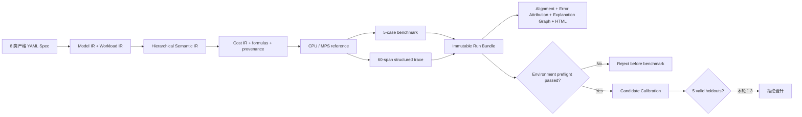

# 最终审计报告：Mac 两层 Transformer 建模与校准穿刺

> **状态：CONTROLLED RERUN PENDING。** 软件与真实执行链路已经交付；受控环境门禁已经实现并识别到当前后台竞争，因此 Goal 不能标记 DONE，Calibration Profile 也没有被错误晋升。

## 交付结果

GroundUpScale 现在具备一个可运行的纵向切片：

核心事实：

- 固定模型：`B=1,S=512,H=512,NH=8,D=64,I=2048,layers=2,FP32`，pre-norm causal Transformer。
- ModelIR 59 modules；SemanticIR/CostIR 52 operations、73 values。
- FLOPs `9,710,850,048`；parameter `33,562,624 B`；buffer `2,097,152 B`。
- CPU/MPS E2E correctness max abs `7.152557e-07`，MPS fallback=false。
- trace 60 spans，其中 52 operator spans；exact Stable Path alignment 100%。
- Explanation Graph 181 nodes/115 edges，可从 latency/throughput/memory 下钻到 scope、公式和 span。
- Semantic peak base `54,534,144 B`；真实 CPU/MPS live Tensor storage peak `69,214,208 B`。
- Run Bundle writer 原子发布、拒绝覆盖，每个 artifact 有 role/Schema/lineage/SHA-256；standalone HTML 可本地打开。
- C020 preflight 对平台、供电、热状态、负载和竞争进程 fail closed；calibration 拒绝未通过环境门禁的 Bundle。

## 验收审计

| AC | 状态 | 结论 |
|---|---|---|
| AC-01 | DONE | clean clone、locked sync、当前本地 42 tests、双 compile byte-identical |
| AC-02 | DONE | 仅改 CPU/MPS YAML Plan 即可运行 |
| AC-03 | DONE | 四层 IR、identity、Shape/dtype、formula、provenance 确定性 |
| AC-04 | DONE | CPU reference 与 MPS correctness/fallback/device audit |
| AC-05 | DONE | FLOPs/bytes/state 独立 literal tests 精确一致 |
| AC-06 | BLOCKED | CPU Softmax noise `3.380%>3%`，未合法进入五次留出 |
| AC-07 | BLOCKED | 3 个有效 MPS holdout error 全过，最大 3.715%；但 valid=3<5 |
| AC-08 | BLOCKED | 有效 MPS memory error 0%，但有效数不足；CPU 无合法留出 |
| AC-09 | DONE | E2E→module/operator/runtime，下钻和未归因桶完整 |
| AC-10 | INCOMPLETE | 公式/span 下钻已完成；因无 active profile，不能伪造 calibration evidence 节点 |
| AC-11 | DONE | GitHub Actions `31102277844` Success；public/trusted lanes 隔离；trusted lane 强制 preflight |
| AC-12 | INCOMPLETE | 当前状态已发布和复验；完整 Goal 仍缺 06/07/08/10 门禁 |

## 校准没有晋升的原因

Candidate `1f66d803cc23...` 只使用 3 个合格 fit Run。7 个独立 MPS holdout 中：

- valid：01、03、04，最大 Case error 分别 2.477%、3.715%、1.370%，memory error 均 0%；
- quarantine：02、05、06、07，各自至少一个 Case `IQR/median>3%`；
- validation：`valid_holdout_runs=3 < minimum=5`，因此 `passed=false`。

这一区分很关键：不是“预测已经错过 5%”，而是“连续测量没有提供足够多满足既定质量的证据”。`promote-calibration` 会拒绝失败 validation，仓库中没有 active calibration 文件。

## 代码与发布证据

- 本地/clean checkout：34 tests。
- 公共 CI：[Compiler CI C020](https://github.com/Kirrito-k423/GroundUpScale/actions/runs/31102277844)，Success，60 秒，包含 42 tests 与 canonical double compile。
- 干净 checkout 验证提交：`97c3dfece742f7f4797a725be1e2be542a0b1843`。
- 运行手册：`docs/runbooks/local-mac-calibration.md`。
- M4/M5 证据：`evidence/m4-milestone-report.md`、`evidence/m5-calibration-attempt-report.md`。

## 已确定的下一步

保持 3%/5 次/5% 原合同不变。C020 已实现 `local-apple-silicon-v1`
preflight；首次真实检查因 normalized load `0.363>0.25`、
`mediaanalysisd 58.1%>25%` 在 benchmark 前拒绝。待这些外部负载消退且
preflight PASS 后，重新建立不复用 C012–C018 的 fit/holdout cohort。

当前最科学的状态是：代码可用、证据完整、失败诚实、门禁自动执行，等待可接受的本机运行条件。
