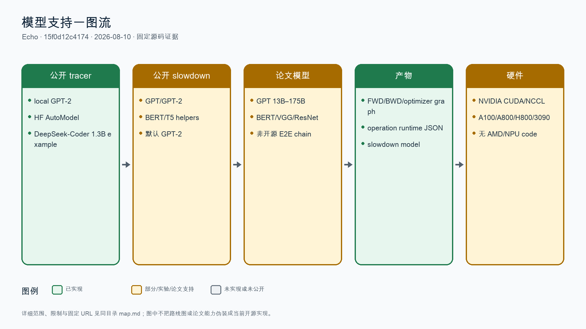
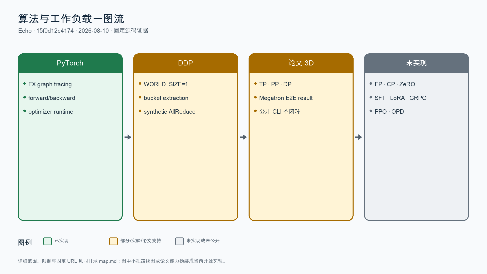
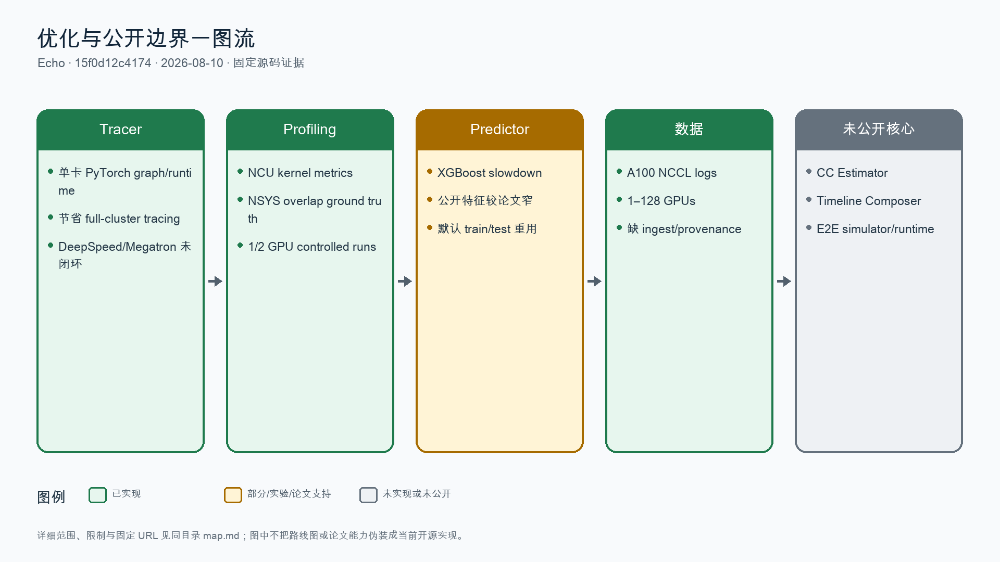

# Echo 全量特性地图

## 分析元数据

| 字段 | 内容 |
|---|---|
| 仓库名称 | Echo |
| 仓库 URL | https://github.com/NetX-lab/Echo |
| 固定提交 SHA | 15f0d12c417459d7a1b3b66abeaa28eca0b841a2 |
| 分支/Tag | main；README 自称 tracer v0.5、slowdown v1.0，但无 tag/release |
| 固定子模块 | Echo-slowdown 7d698a77c0318f2b706ed27d3f6221f8b1e0a349；Echo-workload-tracer 8fb57b6cdc8d5b5505ea4705e6cdf0684bb77424 |
| 分析日期 | 2026-08-10 |
| 分析范围 | 主仓 19 个 tracked entries、slowdown 51 个文件、tracer 99 个文件；README、子模块全量 Python/shell、examples、legacy tests、NCCL logs、论文与 GitHub PR/Release 元数据 |
| 已合入 PR/MR 扫描范围 | 主仓 0 个 merged PR；两个子模块共 7 个 merged PR，全部核验固定子模块基线可达；没有模型专项性能优化 PR |
| 状态定义 | 已实现 / 文档支持 / 实验性 / 规划中 / 推断 / 未发现 |

## 结论摘要

- 固定开源仓不是论文中的完整 Echo 仿真器。它公开了 PyTorch workload tracer、kernel overlap slowdown 数据/模型和 A100 NCCL 日志，但没有 CC Estimator、Timeline Composer、Runtime Manager 或可运行的 E2E 仿真引擎。
- 论文技术路线有价值：单卡 ex-situ tracing、collective 白盒估计、XGBoost overlap slowdown；96×H800 GPT-175B 报告约 8% step error、低于 2 分钟。公开仓无法复现该 E2E 结果。
- 公共 PyTorch tracer 是最完整链路；DDP 是 world-size=1 下合成 AllReduce，DeepSpeed/Megatron 入口仍在开发，Megatron CLI 存在确定性的构造参数错误。
- slowdown 公共流水线从 NCU/NSYS 到 XGBoost 基本闭环，但默认把同一 merged 数据同时用于 train/test，仓内 sample metrics 存在数据泄漏风险。
- Echo 是值得借鉴的论文与局部模块，不是足以让 GroundUpScale 停止的成熟、完整、可复现替代品。

## 模型地图

| 模型名称 | 模型规模 | 输入模态 | 输出模态 | 支持算法 | GPU 支持 | NPU 支持 | 脚本/文档链接 | 状态/证据 |
|---|---|---|---|---|---|---|---|---|
| GPT-2 family | 本地 registry 的 GPT-2 配置；legacy runtime/graph | 文本 token | forward/backward/optimizer graph 与 runtime JSON | PyTorch tracing；部分 DDP bucket/AllReduce synthesis | NVIDIA CUDA；单卡/受控 2 卡路径 | 未发现 NPU | [固定 tracer model](https://github.com/NetX-lab/Echo-workload-tracer/blob/8fb57b6cdc8d5b5505ea4705e6cdf0684bb77424/utils/transformer/gpt.py) | 已实现；公开 tracer 最完整的模型路径 |
| Hugging Face AutoModel / DeepSeek-Coder example | 唯一公开 HF example 为 DeepSeek-Coder-1.3B | 文本 token | FX/operation graph 与 runtime JSON | PyTorch forward/backward/optimizer tracing | NVIDIA CUDA | 未发现 NPU | [固定 HF 案例](https://github.com/NetX-lab/Echo-workload-tracer/blob/8fb57b6cdc8d5b5505ea4705e6cdf0684bb77424/examples/pytorch_tracing_run_huggingface.sh#L8-L16) | 部分支持；通用 AutoModel loader 不等于所有模型已验证 |
| GPT 13B–175B | 13B、30B、40B、70B、175B | 文本训练配置 | 论文 E2E step-time | Megatron 3D parallelism | 64/96×H800 论文验证 | 未发现 NPU | [Echo 论文](https://arxiv.org/pdf/2412.12487v1) | 论文支持；公开仓无可运行 Megatron tracer/CC estimator/E2E simulator，不能标为开源已实现 |
| BERT/T5/VGG/ResNet | BERT/T5 helper；paper/legacy 含 BERT-Large、VGG19、ResNet152 | 文本或图像张量 | kernel/graph runtime 或论文模拟结果 | PyTorch/FSDP 论文验证、slowdown model helper | A100/A800/H800/RTX3090 论文/局部脚本 | 未发现 NPU | [固定 slowdown model helpers](https://github.com/NetX-lab/Echo-slowdown/tree/7d698a77c0318f2b706ed27d3f6221f8b1e0a349/utils/transformer) | 部分/论文支持；公开 recipes 很少，FSDP 无公开实现链 |

## 算法地图

| 算法名称 | 算法类型 | 数据集模态 | 支持模型 | 关键配置/实现 | 典型案例链接 | 状态/证据 |
|---|---|---|---|---|---|---|
| PyTorch forward/backward/optimizer tracing | 训练 workload tracing | 文本/图像 tensor → execution graph/runtime | GPT-2、本地 torchvision/custom、Hugging Face AutoModel | Torch FX、自定义 backward graph、operation profiling | [固定 PyTorchTracer](https://github.com/NetX-lab/Echo-workload-tracer/blob/8fb57b6cdc8d5b5505ea4705e6cdf0684bb77424/tracer_core/pytorch_tracer.py#L117-L237) | 已实现；需 NVIDIA GPU 动态复验 |
| DDP tracing | 数据并行 | model input → graph + synthetic AllReduce | GPT-2/custom PyTorch | 强制 WORLD_SIZE=1，提取 bucket 后合成 DDP 节点 | [固定 DDPGraph](https://github.com/NetX-lab/Echo-workload-tracer/blob/8fb57b6cdc8d5b5505ea4705e6cdf0684bb77424/tracer_core/torch_analysis/ddp_graph.py#L116-L236) | 实验性/部分支持；不是真实 N-rank trace |
| TP/PP/3D Megatron | 分布式训练并行 | 文本训练配置 → rank timeline | 论文 GPT 13B–175B | 论文 ex-situ rank tracing + global timeline；公开 CLI 不闭合 | [论文与开源计划](https://github.com/NetX-lab/Echo/blob/15f0d12c417459d7a1b3b66abeaa28eca0b841a2/README.md#L40-L67) | 文档支持/公开未实现；Megatron constructor 当前参数不匹配 |
| SFT / LoRA / GRPO / PPO / OPD | 监督微调、参数高效微调、在线强化学习、偏好优化 | 不适用 | 不适用 | 主仓、两个子模块、examples、tests 主动搜索均无入口、配置或案例 | [固定主仓树](https://github.com/NetX-lab/Echo/tree/15f0d12c417459d7a1b3b66abeaa28eca0b841a2) | 未发现；Echo 是性能仿真研究制品，不是对齐训练框架 |

## 优化特性地图

| 特性名称 | 一级分类 | 二级分类 | 模型专项/触发条件 | 特性原理 | 收益与影响 | 覆盖模型与范围 | 迁移工作量（代码量） | 使能方式 | 典型代码位置 | 典型脚本 | 已合入 PR/MR | 状态/证据 |
|---|---|---|---|---|---|---|---|---|---|---|---|---|
| 单卡 PyTorch workload tracer | 训练/FSDP | 资源节约型特性 | PyTorch local/HF model；FX 可追踪 | 单卡获取 forward/backward/optimizer graph 与 operation runtime，避免部署完整集群 | 资源收益是减少 tracing 所需 GPU 数；论文声称可服务千卡 workload，但公开链只验证局部；吞吐收益不适用 | GPT-2、HF AutoModel、custom/torchvision | L；约 1200–3500 LoC，12–28 文件；2 人×4–8 人周 | `python main.py --framework PyTorch` | [固定 tracer 入口](https://github.com/NetX-lab/Echo-workload-tracer/blob/8fb57b6cdc8d5b5505ea4705e6cdf0684bb77424/main.py#L28-L79) | [example](https://github.com/NetX-lab/Echo-workload-tracer/blob/8fb57b6cdc8d5b5505ea4705e6cdf0684bb77424/examples/pytorch_tracing_run.sh) | [tracer PR #1](https://github.com/NetX-lab/Echo-workload-tracer/pull/1)，merge bcad453，基线可达 | 已实现 PyTorch 子链；DeepSpeed/Megatron 仍在开发 |
| NCU/NSYS overlap slowdown 数据流水线 | 训练/FSDP | 极致性能特性 | NVIDIA CUDA/NCCL/Nsight；1/2 卡受控 overlap | NCU 采孤立 kernel 特征，NSYS 采通信-计算 overlap 与 slowdown，再 merge 成训练数据 | 可显式建模共享资源干扰；profiling 开销高；跨 GPU 架构需重采 | GPT/GPT-2/BERT/T5 helper；默认 GPT-2 | L；约 1000–3000 LoC，12–25 文件；2 人×4–8 人周 | `run_all.sh` 分阶段采集/merge/train | [固定 NCU 采集](https://github.com/NetX-lab/Echo-slowdown/blob/7d698a77c0318f2b706ed27d3f6221f8b1e0a349/kernel_metric/run.sh#L19-L34) | [固定 NSYS 采集](https://github.com/NetX-lab/Echo-slowdown/blob/7d698a77c0318f2b706ed27d3f6221f8b1e0a349/slowdown_collection/run-nsys.sh#L22-L33) | slowdown PR #1–#5、#9 均基线可达 | 已实现；无 CI/真实硬件自动回归 |
| XGBoost kernel slowdown predictor | 训练/FSDP | 极致性能特性 | 有匹配 GPU/Nsight 特征与 overlap ground truth | 以 baseline duration、throughput、occupancy、cache 等特征拟合 slowdown | 论文显示比 baseline 更准；公开默认 train/test 数据重用，仓内指标不可视为独立 holdout | compute kernels under NCCL overlap | M；约 400–1200 LoC，8–16 文件；1–2 人×2–5 人周 | `training_testing/run.sh` / prediction API | [固定 XGB 训练](https://github.com/NetX-lab/Echo-slowdown/blob/7d698a77c0318f2b706ed27d3f6221f8b1e0a349/training_testing/train.py#L19-L63) | [数据重用位置](https://github.com/NetX-lab/Echo-slowdown/blob/7d698a77c0318f2b706ed27d3f6221f8b1e0a349/run_all.sh#L43-L50) | [slowdown PR #3](https://github.com/NetX-lab/Echo-slowdown/pull/3)，merge 6bfcbe2，基线可达 | 已实现但验证设计有缺陷；公开特征比论文 Table 4 更窄 |
| NCCL-test 1–128 GPU A100 日志 | 训练/Megatron | 资源节约型特性 | A100 cluster；NCCL-test collective | 公开原始 collective bandwidth/latency 日志，可作通信校准或对照数据 | 节省重新采集资源；无 ingest/fit/simulator 脚本，吞吐收益不适用 | 1、2、4、8、16、32、64、128 GPU | S；约 100–400 LoC，3–8 文件；1 人×1–2 人周 | 自行解析日志 | [固定日志说明](https://github.com/NetX-lab/Echo/blob/15f0d12c417459d7a1b3b66abeaa28eca0b841a2/nccl-test-log/README.md#L1-L7) | [128 GPU 日志](https://github.com/NetX-lab/Echo/blob/15f0d12c417459d7a1b3b66abeaa28eca0b841a2/nccl-test-log/nccl_128.log) | 主仓直接提交，无 PR | 已实现数据资产；provenance 与完整环境元数据不足 |
| 完整 CC Estimator + Timeline Composer | 训练/Megatron | 并行特性 | 论文系统；需 MPU/NCCL profiling database | 白盒 collective 模型与跨 rank event timeline，再用 slowdown predictor 校正 | 论文 GPT-175B 96×H800 约 8% error、模拟低于 2 分钟；资源/吞吐数字不可由公开仓复现 | DP/TP/PP 论文场景 | XL；约 4000–10000+ LoC，25–60 文件；3–5 人×8–16+ 人周 | 公开仓无入口 | [论文](https://arxiv.org/pdf/2412.12487v1) | [逐步开源说明](https://github.com/NetX-lab/Echo/blob/15f0d12c417459d7a1b3b66abeaa28eca0b841a2/README.md#L54-L67) | 主仓无 merged PR；核心代码未公开 | 文档支持/公开未发现；不能作为开源已支持能力 |

## 覆盖范围与缺口

- 已检查目录：主仓 README、`.gitmodules`、NCCL logs；Echo-workload-tracer 全部 Python/shell/examples/legacy tests；Echo-slowdown 全部采集、merge、training/testing、outputs；论文 v1。
- 已检查关键词：SFT、LoRA、QLoRA、DPO、GRPO、PPO、OPD、RLHF、FSDP、TP/PP/EP/CP、MoE、ZeRO、CC estimator、timeline、runtime manager、NPKit、NCCL channel/protocol。
- 未验证环境/硬件：无 NVIDIA GPU/Nsight 动态复验；两个子模块 `compileall` 通过，仅证明 Python 语法可编译。
- 网络、权限、子模块或 LFS 限制：GitHub 与论文公开可访问；固定子模块已检出；无 `.codegraph/`。
- 文档与源码冲突：README 称 PyTorch/DeepSpeed/Megatron support，但子模块 README 明说后两者 active development；slowdown README 的 MLP/MAPE/R² 与命令均与固定代码有出入。
- 已合入 PR/MR：主仓 0；slowdown #1–#5、#9 与 tracer #1 共 7 个，全部基线可达，无模型专项优化、无回退。无 tag/release/CI。
- 已主动核查但未发现：论文完整 CC estimator、Timeline Composer、Runtime Manager、E2E simulator、可运行 TP/PP/Megatron/DeepSpeed chain、EP/MoE、CP、ZeRO、SFT、LoRA、GRPO、PPO、OPD、AMD/NPU backend。
- 发布安全缺口：固定 HF example 曾提交明文访问令牌；本报告不复述敏感值，项目应确认令牌已撤销/轮换。

## 证据说明

“论文支持”和“固定开源仓已实现”严格分开。论文 E2E 数字仅说明研究系统在论文配置下的结果；因为关键核心未公开，不能作为当前仓可复现支持。GitHub/API 与外部资料访问日期为 2026-08-10。
