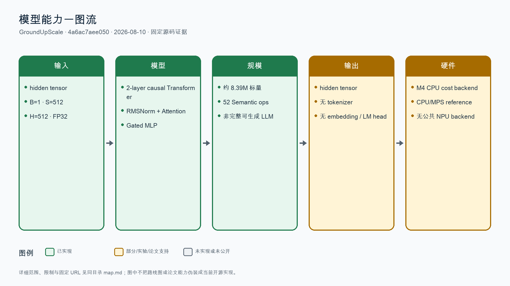
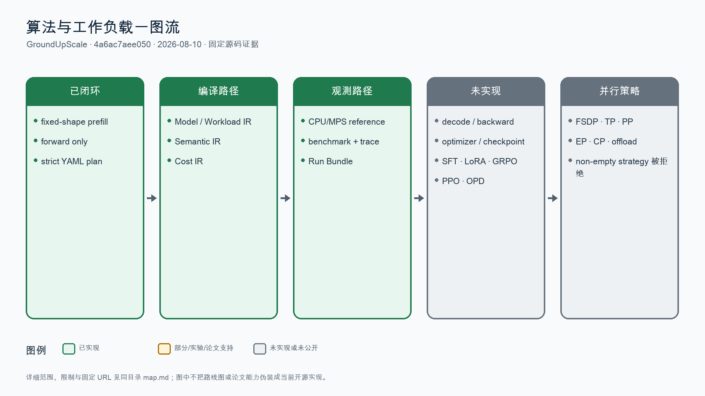
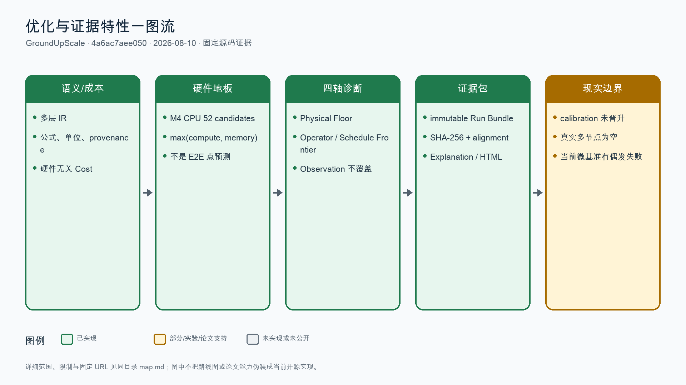

# GroundUpScale 全量特性地图

## 分析元数据

| 字段 | 内容 |
|---|---|
| 仓库名称 | GroundUpScale |
| 仓库 URL | https://github.com/Kirrito-k423/GroundUpScale |
| 固定提交 SHA | 4a6ac7aee0500d10c32ee7463daf24c8a20a5dd2 |
| 分支/Tag | main；无 tag/release |
| 分析日期 | 2026-08-10 |
| 分析范围 | 固定 SHA 的 README、docs、specs、src、tests、CI、硬件证据；另只读核查当前未提交工作区，但不将其计为固定基线能力 |
| 已合入 PR/MR 扫描范围 | GitHub API 与仓内历史显示 0 个已合入 PR；固定基线约 27 个提交、单一作者；无模型专项 PR 可深读 |
| 状态定义 | 已实现 / 文档支持 / 实验性 / 规划中 / 推断 / 未发现 |

## 结论摘要

- 固定基线是一个早期的、证据优先的性能建模与诊断编译器，不是成熟的大规模训练仿真器。它已打通严格 YAML、Model/Workload/Semantic/Cost IR、M4 CPU 后端、Run Bundle、测量与四轴诊断。
- 真正差异化在可审计 provenance、不可互相覆盖的 Physical Floor / Operator Frontier / Schedule Frontier / Observation，以及证据不足时返回 structured unknown。
- 实际能力面很窄：只有约 8.39M 参数的两层 Transformer、固定 FP32 prefill forward、Apple M4 CPU 一个预测后端；网络、collective、真实并行策略、训练、decode 与 RL 均未闭环。
- 固定基线在独立导出树上为 `349 passed`；当前未提交工作区实跑为 `388 passed, 1 failed`，失败单测单独复跑通过，暴露真实微基准门禁的环境/顺序敏感性。
- 建议保留可信建模和诊断内核，把 SimAI/Echo 或其他系统作为 workload、trace、collective、network backend 来源，不再从零复制全栈模拟器。

## 模型地图

| 模型名称 | 模型规模 | 输入模态 | 输出模态 | 支持算法 | GPU 支持 | NPU 支持 | 脚本/文档链接 | 状态/证据 |
|---|---|---|---|---|---|---|---|---|
| 两层 pre-norm causal Transformer reference | 约 8.39M FP32 标量；2 层；B=1、S=512、H=512、8 heads | 文本隐藏状态张量 | 文本隐藏状态张量；无 tokenizer/LM head | 固定 prefill forward | MPS 仅参考执行/观测，不是预测后端 | 无公共 NPU 后端；仅有 910B2 单 MatMul 票据证据 | [固定模型规格](https://github.com/Kirrito-k423/GroundUpScale/blob/4a6ac7aee0500d10c32ee7463daf24c8a20a5dd2/specs/models/two-layer-transformer.yaml) | 已实现；52 Semantic ops、73 values、22 state artifacts 有测试闭环；不等同完整 LLM |

## 算法地图

| 算法名称 | 算法类型 | 数据集模态 | 支持模型 | 关键配置/实现 | 典型案例链接 | 状态/证据 |
|---|---|---|---|---|---|---|
| 固定形状 prefill forward | 推理工作负载 | 文本隐藏状态 → 文本隐藏状态 | 两层 Transformer reference | strict YAML → Model/Workload/Semantic/Cost IR → CPU/MPS reference | [prefill workload](https://github.com/Kirrito-k423/GroundUpScale/blob/4a6ac7aee0500d10c32ee7463daf24c8a20a5dd2/specs/workloads/prefill.yaml) | 已实现；无 decode、backward、optimizer 或 checkpoint 主链 |
| SFT / LoRA / GRPO / PPO / OPD | 监督微调、参数高效微调、在线强化学习、偏好优化 | 不适用 | 不适用 | 主动检查 README、docs、specs、src、tests 均无入口、配置或案例 | [固定仓库树](https://github.com/Kirrito-k423/GroundUpScale/tree/4a6ac7aee0500d10c32ee7463daf24c8a20a5dd2) | 未发现；README 中 training/RL 仅为 intended scope |

## 优化特性地图

| 特性名称 | 一级分类 | 二级分类 | 模型专项/触发条件 | 特性原理 | 收益与影响 | 覆盖模型与范围 | 迁移工作量（代码量） | 使能方式 | 典型代码位置 | 典型脚本 | 已合入 PR/MR | 状态/证据 |
|---|---|---|---|---|---|---|---|---|---|---|---|---|
| 多层 IR 与单位校验 Cost 公式 | 推理 | 资源节约型特性 | 通用；当前只验证两层 Transformer | 分离 Model、Workload、Semantic、Cost 与硬件候选，保留 Stable Path、公式、bounds 和 provenance | 主要收益是可解释性与避免重复计数；不直接承诺吞吐提升；当前算子集有限 | MatMul、Add、RMSNorm、Softmax、SiLU、Mul、View、Transpose | L；约 800–2000 LoC，8–20 文件；另需 importer、golden/metamorphic tests 与文档 | `groundupscale compile` 或 AnalysisPlan | [编译主链](https://github.com/Kirrito-k423/GroundUpScale/blob/4a6ac7aee0500d10c32ee7463daf24c8a20a5dd2/src/groundupscale/pipeline.py#L29-L80) | [fixed plan](https://github.com/Kirrito-k423/GroundUpScale/blob/4a6ac7aee0500d10c32ee7463daf24c8a20a5dd2/specs/plans/mac-cpu-prefill.yaml) | 主仓无已合入 PR；当前能力来自直接提交 | 已实现；硬件无关主链有单元与不变量测试 |
| Apple M4 CPU 物理资源地板 | 推理 | 极致性能特性 | Apple M4 CPU；公开能力与版本化实测 envelope 完整时 | 对每个 Cost region 生成实现候选，以最小数学工作和 unique compulsory bytes 形成 `max(compute,memory)` 下界 | 输出优化 headroom，而非 E2E 点预测；52 候选可钻取；`full_duration_ns` 仍为空 | 固定 prefill 的 52 个算子候选 | M；约 400–1200 LoC，6–15 文件；另需真实硬件校准与 CI 隔离 | 选择 `apple-m4-cpu` deployment intent | [M4 后端](https://github.com/Kirrito-k423/GroundUpScale/blob/4a6ac7aee0500d10c32ee7463daf24c8a20a5dd2/src/groundupscale/backends/apple_m4_cpu.py#L177-L340) | [本机证据脚本](https://github.com/Kirrito-k423/GroundUpScale/blob/4a6ac7aee0500d10c32ee7463daf24c8a20a5dd2/scripts/run-local-m4-evidence.sh) | 主仓无已合入 PR | 已实现；只有 CPU 预测后端，MPS 仅参考执行 |
| 四轴性能诊断与 fail-closed evidence | 调度 | 资源节约型特性 | 通用；必须有完整 run/evidence identity | Physical Floor、Operator Frontier、Schedule Frontier、Observation 不互相覆盖；缺 correctness/cohort/timer/uncertainty 时返回 unknown | 降低误判、错误回归归因和证据污染风险；资源/吞吐收益未量化 | Capability Surface、shape seam/hole、candidate family、diagnostic verdict | L；约 1500–5000 LoC，15–35 文件；另需 schema、迁移器、fixture 与硬件验证 | `groundupscale diagnose` 与 versioned evidence bundle | [诊断规范](https://github.com/Kirrito-k423/GroundUpScale/blob/4a6ac7aee0500d10c32ee7463daf24c8a20a5dd2/docs/methods/cross-hardware-performance-gap-diagnosis.md#L26-L57) | [诊断测试](https://github.com/Kirrito-k423/GroundUpScale/blob/4a6ac7aee0500d10c32ee7463daf24c8a20a5dd2/tests/test_diagnostic_verdict.py) | 主仓无已合入 PR | 已实现诊断内核；真实跨硬件生产证据仍少 |
| Immutable Run Bundle 与解释图 | 调度 | 资源节约型特性 | 通用；每次 compile/run 生成独立 bundle | 锁定输入、artifact role、SHA-256、trace/alignment/live-set、comparison 与 HTML 共享一套结构化事实 | 提升复现与审计效率；存储开销增加；吞吐收益未量化 | 当前 CPU/MPS reference run | M；约 500–1500 LoC，8–20 文件；另需 adapter、schema migrations 与验证器 | `groundupscale run`、`verify-run`、`explain` | [Run Bundle](https://github.com/Kirrito-k423/GroundUpScale/blob/4a6ac7aee0500d10c32ee7463daf24c8a20a5dd2/src/groundupscale/run_bundle.py) | [workspace 文档](https://github.com/Kirrito-k423/GroundUpScale/blob/4a6ac7aee0500d10c32ee7463daf24c8a20a5dd2/docs/reference/workspace-and-run-bundle.md) | 主仓无已合入 PR | 已实现；Hosted Web explorer 仍是设计目标 |
| 受控校准与独立 holdout 晋升 | 推理 | 资源节约型特性 | 同一硬件 cohort；passed preflight；fit/holdout 不重叠 | 拒绝 mixed cohort、noisy fit、无效 holdout；至少 5 个 valid holdout 且误差门禁通过才 active | 防止把观测静默覆盖基线；当前校准未晋升，因此无已兑现吞吐收益 | Apple M4 CPU/MPS 证据流程 | M；约 400–1200 LoC，8–16 文件；另需采集会话和环境治理 | calibration CLI/workflow | [校准实现](https://github.com/Kirrito-k423/GroundUpScale/blob/4a6ac7aee0500d10c32ee7463daf24c8a20a5dd2/src/groundupscale/calibration.py#L215-L323) | [未晋升报告](https://github.com/Kirrito-k423/GroundUpScale/blob/4a6ac7aee0500d10c32ee7463daf24c8a20a5dd2/goal_process/mac-transformer-ir-calibration-slice/FINAL-REPORT.md#L63-L71) | 主仓无已合入 PR | 已实现流程；仅 3 个 valid holdouts，未形成 active calibration |

## 覆盖范围与缺口

- 已检查目录：`README.md`、`CONTEXT.md`、`docs/`、`specs/`、`src/`、`tests/`、`.github/workflows/`、`goal_process/`。
- 已检查关键词：模型 registry/importer、training、backward、optimizer、checkpoint、decode、SFT、LoRA、QLoRA、GRPO、PPO、OPD、DPO、RLHF、TP、PP、EP、CP、FSDP、offload、allreduce、network、collective。
- 未验证环境/硬件：本轮未重新执行 MPS/Ascend 实机采集；固定 SHA 的独立 CPU 测试为 `349 passed`。当前未提交工作区全量测试一次出现 1 个微基准 shape eligibility 偶发失败，单测复跑通过。
- 网络、权限、子模块或 LFS 限制：公开 GitHub 可访问；仓库无子模块/LFS；无 `.codegraph/`。
- 文档与源码冲突：README 的训练、推理、RL、FSDP/TP/PP/EP/CP 等为 intended scope；固定实现只闭环 fixed prefill forward，任何非空 strategy binding 当前会被编译器拒绝。
- 已合入 PR/MR：主仓 API/历史未发现已合入 PR/MR；因此候选 0、深读 0。固定基线由直接提交组成。
- 已主动核查但未发现：SFT、LoRA、QLoRA、GRPO、PPO、OPD、DPO、RLHF、真实模型 importer、decode、backward、optimizer、collective/network runtime、公共 GPU/NPU cost backend、已晋升 calibration profile。

## 证据说明

所有公开源码证据固定到 `4a6ac7aee0500d10c32ee7463daf24c8a20a5dd2`。当前未提交工作区中的 compound phase graph、exact-shape Operator Frontier 与扩展微基准仅作为研发中增量，不计入支持状态。外部资料与 GitHub 元数据访问日期为 2026-08-10。
