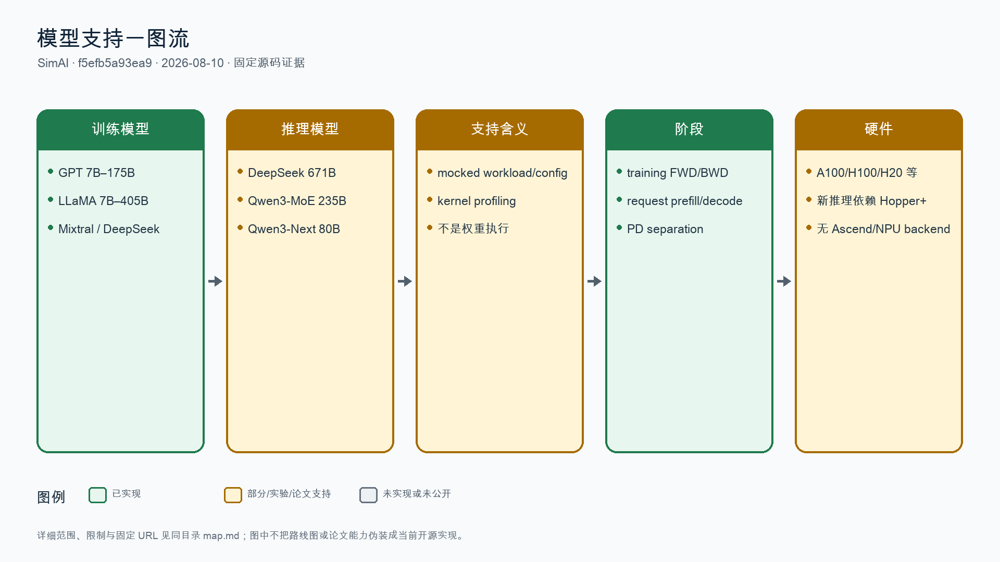
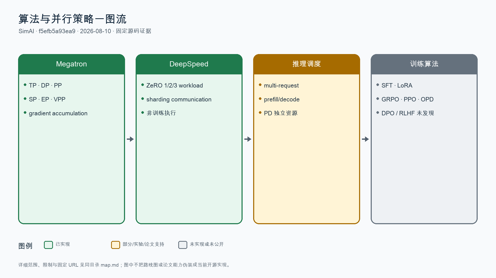
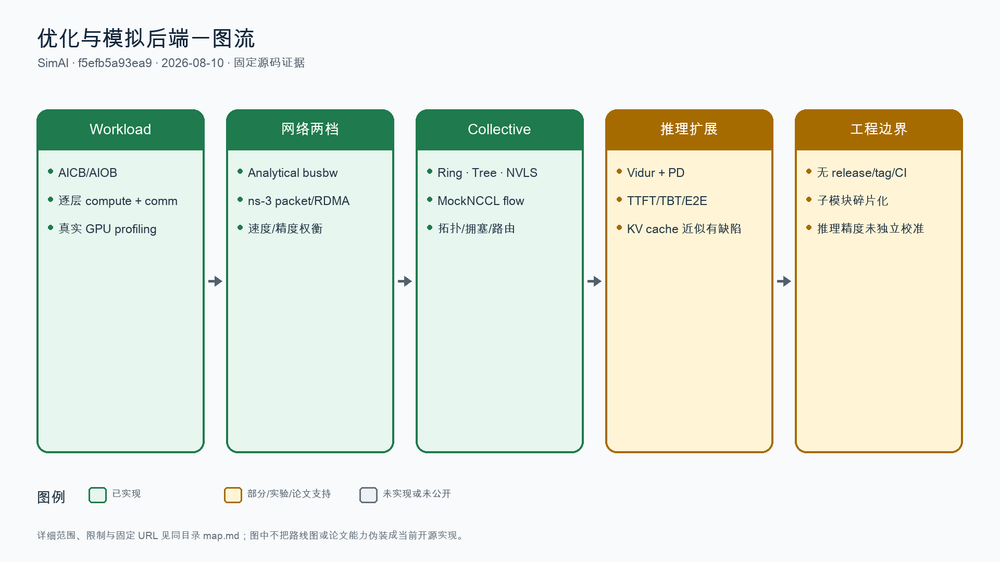

# SimAI 全量特性地图

## 分析元数据

| 字段 | 内容 |
|---|---|
| 仓库名称 | SimAI |
| 仓库 URL | https://github.com/aliyun/SimAI |
| 固定提交 SHA | f5efb5a93ea9be7db25a8843f9f7ff54044f6062 |
| 分支/Tag | master；README 称 1.6，但无 GitHub tag/release |
| 固定子模块 | AICB 23eec3c48ca2d2d93dd888a4c7b22ab4421e782f；SimCCL 403610a0f91659e628428afa8d489cb046ef9503；ns-3-alibabacloud 7e3cb5b88c99abcb582c5abc3919484a4805111b |
| 分析日期 | 2026-08-10 |
| 分析范围 | 主仓 385 个 tracked entries；AICB 108、SimCCL 5、ns-3 3796 个固定子模块项；README/docs/examples/build、ASTRA workload/system/network frontend、Vidur、tests 与已合入 PR |
| 已合入 PR/MR 扫描范围 | GitHub API 共 33 个已合入 PR；32 个进入 master、1 个进入 SimCCL 分支；深读 network、EP、physical、inference/PD、1.6 memory 等高价值候选，均核验基线可达性 |
| 状态定义 | 已实现 / 文档支持 / 实验性 / 规划中 / 推断 / 未发现 |

## 结论摘要

- SimAI 是三者中开源能力最完整的全栈分布式训练/推理模拟器，强项是 workload、计算时间、collective/NCCL、packet-level RoCE、拓扑与 analytical 快速模型的跨层组合。
- NSDI'25 的训练实验报告平均 98.1% 对齐真实结果，覆盖 A100/H100、128–1024 GPU 与 GPT-3/LLaMA；该精度不能外推到 2025–2026 新增的多请求推理、PD 分离和显存规划。
- 模型“支持”主要是 mocked workload/config 和 profiling 支持，不代表加载权重或执行真实训练算法。SFT、LoRA、GRPO、PPO、OPD 等训练/对齐算法均未发现。
- 1.6 推理路径仍有严重近似：部分 KV cache 长度硬编码为 1、AICB backend 的 TP 通信时间置 0、DeepSeek profiling 失败时用经验公式降级；推理 E2E 精度证据不足。
- 工程治理落后于能力广度：无 tag/release、主仓无 CI，README 的版本、许可、缺失治理链接和 `submodule update --remote` 存在复现/一致性风险。

## 模型地图

| 模型名称 | 模型规模 | 输入模态 | 输出模态 | 支持算法 | GPU 支持 | NPU 支持 | 脚本/文档链接 | 状态/证据 |
|---|---|---|---|---|---|---|---|---|
| GPT 系列 | 7B、13B、22B、175B | 文本 token/配置 | workload 与 step-time | Megatron TP/DP/PP/SP/VPP；DeepSpeed ZeRO；training forward/backward | A100/H100/H20 等 profiling/仿真 | 未发现 Ascend/HCCL/torch_npu；ASTRA 中 NPU 是通用命名 | [AICB 固定矩阵](https://github.com/aliyun/aicb/blob/23eec3c48ca2d2d93dd888a4c7b22ab4421e782f/README.md#L77-L95) | 已实现 workload；论文验证 GPT-3 13B/175B，不等于真实模型执行 |
| LLaMA/Llama 3 | 7B、65B、405B；推理另含 Llama 2/3 7B–70B | 文本 token/配置 | workload 与 step-time | Megatron/DeepSpeed training；request-level inference | NVIDIA GPU profiling；论文验证 LLaMA 65B | 未发现 NPU backend | [AICB 矩阵](https://github.com/aliyun/aicb/blob/23eec3c48ca2d2d93dd888a4c7b22ab4421e782f/README.md#L77-L95) | 已实现/部分支持；推理范围与后端精度需逐配置核验 |
| DeepSeek-V3/R1 family | 16B、236B、671B；V3 为 671B total/约 37B activated | 文本请求或训练配置 | training/inference workload、TTFT/TBT/E2E | TP/DP/PP/EP workload；PD 分离；MLA KV cache | Hopper/Blackwell 依赖 DeepGEMM/FlashMLA；H20 TP≥4 prefill profiling 有已知失败 | 未发现 NPU backend | [固定推理场景](https://github.com/aliyun/SimAI/blob/f5efb5a93ea9be7db25a8843f9f7ff54044f6062/vidur-alibabacloud/README.md#L316-L342) | 已实现但部分降级；缺 profiling 时经验公式仍可让流程“通过” |
| Qwen3-MoE | 235B total/22B activated；另有 30B 配置 | 文本请求 | inference workload、TTFT/TBT/E2E | TP 与请求调度；EP 参数可配置但 SimAI 推理后端 PP/EP 仍受限 | Hopper/Blackwell；部分 AICB kernel/profile | 未发现 NPU backend | [固定模型配置与限制](https://github.com/aliyun/SimAI/blob/f5efb5a93ea9be7db25a8843f9f7ff54044f6062/vidur-alibabacloud/README.md#L89-L98) | 部分支持；MoE/PP communication module 文档标为 in progress |
| Qwen3-Next | 80B MoE/混合 full+linear attention | 文本请求 | inference workload、TTFT/TBT/E2E | TP、PD 分离、request scheduling | Hopper/Blackwell；GDN profiling 数据准确性受限 | 未发现 NPU backend | [固定 AICB 说明](https://github.com/aliyun/aicb/blob/23eec3c48ca2d2d93dd888a4c7b22ab4421e782f/README.md#L318-L324) | 实验性；文档明确 GDN profiling 可能不准确 |

## 算法地图

| 算法名称 | 算法类型 | 数据集模态 | 支持模型 | 关键配置/实现 | 典型案例链接 | 状态/证据 |
|---|---|---|---|---|---|---|
| Megatron 3D + SP/EP/VPP | 分布式训练并行 | 文本训练配置 → 逐层计算/通信 workload | GPT、LLaMA、Mixtral、DeepSeek | TP、DP、PP、SP、EP、DP_EP、virtual pipeline、gradient accumulation | [AICB 参数矩阵](https://github.com/aliyun/aicb/blob/23eec3c48ca2d2d93dd888a4c7b22ab4421e782f/training/tutorial.md#L123-L169) | 已实现 workload 与 ASTRA event chain；不是训练框架本身 |
| DeepSpeed ZeRO 1/2/3 workload | 资源节约型训练并行 | 文本训练配置 → forward/backward/collective workload | GPT/LLaMA family | 单独 workload generator 表达 optimizer/gradient/parameter sharding 的通信模式 | [DeepSpeed 示例](https://github.com/aliyun/aicb/blob/23eec3c48ca2d2d93dd888a4c7b22ab4421e782f/README.md#L184-L211) | 已实现 workload 生成；无训练正确性/收敛验证 |
| 多请求 prefill/decode 与 PD 分离 | 推理调度 | request arrival trace → prefill/decode events | DeepSeek、Qwen3、Llama family | Vidur scheduler、独立 P/D budget、TTFT/TBT/E2E | [Vidur 固定文档](https://github.com/aliyun/SimAI/blob/f5efb5a93ea9be7db25a8843f9f7ff54044f6062/vidur-alibabacloud/README.md#L32-L98) | 已实现但部分支持；SimAI inference backend 主要只支持 TP |
| SFT / LoRA / GRPO / PPO / OPD | 监督微调、参数高效微调、在线强化学习、偏好优化 | 不适用 | 不适用 | 主仓与固定子模块主动搜索无入口、配置或案例 | [固定主仓树](https://github.com/aliyun/SimAI/tree/f5efb5a93ea9be7db25a8843f9f7ff54044f6062) | 未发现；`kv_lora_rank` 是 MLA KV 压缩维度，不是 LoRA 微调 |

## 优化特性地图

| 特性名称 | 一级分类 | 二级分类 | 模型专项/触发条件 | 特性原理 | 收益与影响 | 覆盖模型与范围 | 迁移工作量（代码量） | 使能方式 | 典型代码位置 | 典型脚本 | 已合入 PR/MR | 状态/证据 |
|---|---|---|---|---|---|---|---|---|---|---|---|---|
| Analytical busbw 网络抽象 | 训练/Megatron | 极致性能特性 | 通用 collective；busbw 参数或自动计算 | 以 bus bandwidth 估算 collective/P2P 时间，忽略 packet-level 网络细节 | 显著降低仿真时间、适合参数 sweep；精度取决于 busbw；未给统一 E2E 误差 | training workload 与部分 inference TP | M；约 400–1200 LoC，6–15 文件；另需 collective calibration 与 tests | build analytical；`SimAI_analytical` | [Analytical 入口](https://github.com/aliyun/SimAI/blob/f5efb5a93ea9be7db25a8843f9f7ff54044f6062/astra-sim-alibabacloud/astra-sim/network_frontend/analytical/AnalyticalAstra.cc#L68-L140) | [README 命令](https://github.com/aliyun/SimAI/blob/f5efb5a93ea9be7db25a8843f9f7ff54044f6062/README.md#L180-L190) | [PR #144](https://github.com/aliyun/SimAI/pull/144)，merge 26b4574，基线可达 | 已实现；README 仍有“自动 busbw 即将开源”的过期文字 |
| ns-3 packet/RDMA 网络仿真 | 训练/Megatron | 极致性能特性 | 需 topology、SimAI.conf、collective flow | ASTRA workload 事件驱动 ns-3；模拟 QP、PFC、ECN/CNP、ECMP、NVSwitch、DCQCN/HPCC 等 | 训练论文 communication deviation A100 3.9%、H100 2.3%；代价是仿真慢，128-GPU Echo 论文对照约 7655s | 训练 collective 与网络/拓扑研究；推理当前 TP 为主 | XL；约 4000–12000+ LoC，30–60+ 文件；3–5 人×8–16+ 人周 | build ns3；`SimAI_simulator` | [ns-3 入口](https://github.com/aliyun/SimAI/blob/f5efb5a93ea9be7db25a8843f9f7ff54044f6062/astra-sim-alibabacloud/astra-sim/network_frontend/ns3/AstraSimNetwork.cc#L260-L334) | [运行案例](https://github.com/aliyun/SimAI/blob/f5efb5a93ea9be7db25a8843f9f7ff54044f6062/docs/Tutorial.md#L244-L257) | [PR #78](https://github.com/aliyun/SimAI/pull/78)，merge 0253299，基线可达 | 已实现；完整 CUDA/ns-3 环境未在本轮复跑 |
| MockNCCL collective flow model | 训练/Megatron | 并行特性 | GPU type、message size、group 与 collective 算法满足门控 | Ring、Tree、NVLS 等把 collective 展开为 point-to-point flow/event | 提高通信行为真实性；NVLS 自动选择仅覆盖特定 H100/H800 TP AllReduce 条件；吞吐收益需同环境验证 | AllReduce、AllGather、ReduceScatter 等 | XL；约 3000–9000 LoC，25–55 文件；3–5 人×8–16 人周 | collective config / MockNCCL | [算法选择](https://github.com/aliyun/SimAI/blob/f5efb5a93ea9be7db25a8843f9f7ff54044f6062/astra-sim-alibabacloud/astra-sim/system/MockNcclGroup.cc#L2028-L2100) | [Ring/NVLS 案例](https://github.com/aliyun/SimAI/blob/f5efb5a93ea9be7db25a8843f9f7ff54044f6062/docs/Tutorial.md#L264-L297) | [PR #78](https://github.com/aliyun/SimAI/pull/78) | 已实现；独立 SimCCL 子模块仍近似占位，主链实际用仓内 MockNCCL |
| AICB/AIOB computation workload profiling | 训练/Megatron | 极致性能特性 | NVIDIA GPU 可用；模型 mocked compute pattern 完整 | 生成逐层计算/通信 workload，用真实 kernel profiling 或经验模型填 compute duration | 论文实测 kernel 估计偏差 0.5%–3.1%；无 GPU 模型估计偏差 13%–15%；真实 profiling 成本高 | GPT/LLaMA/Mixtral/DeepSeek/Qwen workload | L；约 1500–5000 LoC，15–35 文件；2–3 人×4–8 人周 | AICB generator 与 `--aiob_enable` | [AICB 训练入口](https://github.com/aliyun/aicb/blob/23eec3c48ca2d2d93dd888a4c7b22ab4421e782f/workload_generator/SimAI_training_workload_generator.py) | [训练脚本](https://github.com/aliyun/aicb/blob/23eec3c48ca2d2d93dd888a4c7b22ab4421e782f/scripts/megatron_workload_with_aiob.sh) | AICB gitlink 固定；模型扩展由多次主仓 PR 引入 | 已实现；模型支持是 workload 语义，不是权重执行 |
| 多请求推理 + PD 分离调度 | 推理 | 并行特性 | request trace 与独立 prefill/decode replicas | 改造 Vidur，分别调度 prefill/decode，输出 TTFT/TBT/E2E 与资源规划 | 潜在提升请求级容量决策；缺真实 serving 精度校准；PP/EP/MoE 多处受限 | DeepSeek/Qwen3/Llama configs | L；约 1800–6000 LoC，18–45 文件；2–4 人×6–12 人周 | Vidur scenarios / replica config | [PD 实现文档](https://github.com/aliyun/SimAI/blob/f5efb5a93ea9be7db25a8843f9f7ff54044f6062/vidur-alibabacloud/README.md#L32-L98) | [四场景脚本](https://github.com/aliyun/SimAI/blob/f5efb5a93ea9be7db25a8843f9f7ff54044f6062/vidur-alibabacloud/examples/vidur-ali-scenarios/run_scenarios.sh) | [PR #203](https://github.com/aliyun/SimAI/pull/203) 与 [PR #268](https://github.com/aliyun/SimAI/pull/268)，均可达 | 部分支持；四场景可能在缺 profiling 时退化为经验公式 |
| 推理参数/KV cache 显存规划 | 推理 | 资源节约型特性 | DeepSeek MLA、Qwen MHA/GQA/混合注意力；P/D budget | 参数计数 + KV cache 模型 + OOM check + P/D 独立预算 | 可估算 HBM/最大 batch；但 request KV 长度硬编码为 1 会严重低估，当前不可当生产容量真值 | DeepSeek-V3、Qwen3-MoE、Qwen3-Next | M；约 500–1600 LoC，8–20 文件；1–2 人×3–6 人周 | memory planner / Vidur config | [memory planner](https://github.com/aliyun/SimAI/blob/f5efb5a93ea9be7db25a8843f9f7ff54044f6062/vidur-alibabacloud/vidur/scheduler/utils/memory_planner.py#L25-L123) | [显存文档](https://github.com/aliyun/SimAI/blob/f5efb5a93ea9be7db25a8843f9f7ff54044f6062/vidur-alibabacloud/README.md#L59-L85) | [PR #268](https://github.com/aliyun/SimAI/pull/268) | 已实现但有已知严重近似；需真实请求长度与独立验证 |

## 覆盖范围与缺口

- 已检查目录：主仓 README/docs/example/scripts、`astra-sim-alibabacloud/astra-sim` workload/system/network_frontend、Vidur、tests；固定 AICB、SimCCL、ns-3 子模块。
- 已检查关键词：SFT、LoRA、QLoRA、DPO、GRPO、PPO、OPD、RLHF、RLAIF、reward、distill、TP/DP/PP/SP/EP/VPP、ZeRO、collective、NVLS、PFC、ECN、DCQCN、HPCC、inference、PD、memory。
- 未验证环境/硬件：本轮无完整 CUDA/H20/ns-3/Physical RDMA 动态复验；Vidur 单测在收集阶段因缺 `networkx` 失败，未修改用户环境。
- 网络、权限、子模块或 LFS 限制：GitHub 与论文公开可访问；固定子模块已检出；无 `.codegraph/`。README 建议 `submodule update --remote`，会偏离固定 gitlink，是复现风险。
- 文档与源码冲突：license badge 写 MIT 而根 LICENSE 为 Apache-2.0；自动 busbw 文档过期；治理链接文件不存在；推理“scenario pass”可能实际使用经验降级。
- 已合入 PR/MR：扫描 33 个 merged PR；深读 #13、#26、#28、#53、#78、#100、#144、#203、#268 等，相关 merge 均可达基线；未发现回退。GitHub tag/release 为 0。
- 已主动核查但未发现：SFT、LoRA/QLoRA、GRPO、PPO、OPD、DPO、RLHF/RLAIF、Ascend/torch_npu/HCCL 后端、公开推理 E2E 精度校准、主链 CI。

## 证据说明

公开源码链接固定到主仓和三个子模块完整 SHA。NSDI'25 的 98.1% alignment 仅作为论文训练基线，不外推到后续 inference/PD/memory 代码。GitHub/API 与外部资料访问日期为 2026-08-10；未运行的硬件能力均明确保留为未验证。
